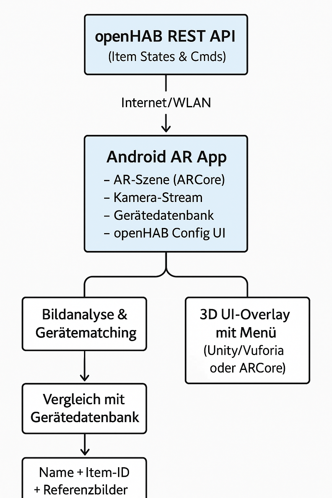

# Augmented Reality-basierte Steuerung von Smart-Home-Geräten über openHAB auf Android

| | |
| --- | --- |
| **Art** | Bachelorarbeit |
| **Schwerpunkte** | Mobile Development (Android), Augmented Reality, Bilderkennung/ML, REST |
| **Ausschreibung** | [Android-AR-Steuerung mit openHAB.odt](Ausschreibungen/Android-AR-Steuerung%20mit%20openHAB.odt) |
| **Verwandte Ideen** | [Chatbot](Chatbot%20f%C3%BCr%20openHAB.md), [Sprachassistent](Sprachassistent.md) |

<!-- TOC -->
## Inhaltsverzeichnis

- [Kurzbeschreibung:](#kurzbeschreibung)
- [Ziele der Arbeit:](#ziele-der-arbeit)
- [Anforderungen](#anforderungen)
  - [Funktionale Anforderungen:](#funktionale-anforderungen)
  - [Nicht-funktionale Anforderungen:](#nicht-funktionale-anforderungen)
- [Technologien & Frameworks (Auswahl):](#technologien--frameworks-auswahl)
  - [📱 AR Frameworks:](#-ar-frameworks)
- [🌐 Smart-Home Integration:](#-smart-home-integration)
- [🧠 Bilderkennung & ML (optional):](#-bilderkennung--ml-optional)
- [🧰 Weitere Technologien:](#-weitere-technologien)
- [📊 Schaubild: Systemübersicht](#-schaubild-systemübersicht)
- [Systemaufbau](#systemaufbau)
  - [openHAB Config UI](#openhab-config-ui)
  - [AR-Szene mit Kamerastream und 3D UI-Overlay mit Menü](#ar-szene-mit-kamerastream-und-3d-ui-overlay-mit-menü)
  - [Gerätedatenbank](#gerätedatenbank)
- [Mögliche AR-Vorgehensweise](#mögliche-ar-vorgehensweise)
  - [Unity + Vuforia](#unity--vuforia)
- [ARCore und Machine Learning](#arcore-und-machine-learning)
  - [🧠 Architekturüberblick](#-architekturüberblick)
  - [📱 Beispiel-Ablauf in deiner App](#-beispiel-ablauf-in-deiner-app)
  - [🧰 Technologien, die du brauchst](#-technologien-die-du-brauchst)
  - [🧪 ML-Vergleich: Wie geht das?](#-ml-vergleich-wie-geht-das)
  - [🧩 Gerätemodell in Room (Beispiel)](#-gerätemodell-in-room-beispiel)
  - [🧠 Workflow in Code (vereinfacht)](#-workflow-in-code-vereinfacht)
  - [📦 Projektstruktur (Android-Kotlin)](#-projektstruktur-android-kotlin)
  - [✅ Vorteile dieses Ansatzes:](#-vorteile-dieses-ansatzes)
- [Handy trainiert selbst](#handy-trainiert-selbst)
- [🔜 Nächste Schritte:](#-nächste-schritte)
- [Aktualitätshinweise (Stand 2026)](#aktualitätshinweise-stand-2026)
  - [Alternative zum On-Device-Training](#alternative-zum-on-device-training)
- [Vorarbeiten im Labor](#vorarbeiten-im-labor)
- [Grundlagen im Kompendium Informatik](#grundlagen-im-kompendium-informatik)
<!-- /TOC -->

## Kurzbeschreibung:

Im Rahmen dieser Bachelorthesis soll eine Android-App entwickelt werden, die mithilfe von Augmented Reality (AR) Smart-Home-Geräte aus openHAB erkennt und interaktiv steuern kann. Die Geräte werden im Kamerabild identifiziert und mit einem überlagerten 3D-Interface versehen. Über dieses Interface soll der Benutzer Aktionen wie Ein-/Ausschalten, Werte einstellen oder Zustände abfragen können. Zudem soll eine Konfigurationsoberfläche implementiert werden, um die Verbindung zu openHAB über die REST-API herzustellen und neue Geräte mit Referenzbildern manuell einzupflegen.

## Ziele der Arbeit:

* Entwicklung einer Android-App mit AR-Funktionalität
* Integration einer REST-Schnittstelle zu openHAB
* Visualisierung von Geräten mittels 3D-Modellen und Interaktionsmenüs im Kamerabild
* Konfigurationsmenüs zum Hinzufügen neuer Geräte (per Fotos) und Verwaltung der REST-Verbindung zu openHAB
* Bilderkennung zum Abgleich von Geräten im Raum
* Vergleich der verschiedenen Lösungsansätze

## Anforderungen

### Funktionale Anforderungen:

1. Geräteerkennung über Kamera:
  * Bildbasierte Erkennung von physischen Geräten
  * Zuordnung zu einem bestimmten openHAB-Item anhand gespeicherter Bilder
2. Augmented Reality UI:
  * Anzeige eines 3D-Objekts (z. B. Schalter, Regler) über dem erkannten Gerät
  * Öffnen eines Menüs beim Tippen auf das AR-Objekt
3. openHAB-Anbindung:
  * Konfiguration der REST-API-Adresse
  * Kommunikation mit openHAB zur Steuerung (Commands) und Statusabfrage (States)
4. Konfigurationsmodul:
  * Hinzufügen neuer Geräte
  * Zuweisung von Bildern zur späteren Erkennung
  * Mapping zum openHAB-Itemnamen

### Nicht-funktionale Anforderungen:

* Mobile-first Design (Android)
* AR-Erkennung soll performant im Innenraum arbeiten
* Erweiterbarkeit durch neue Gerätetypen

## Technologien & Frameworks (Auswahl):

### 📱 AR Frameworks:

* ARCore (Google)
  * Android-nativ
  * Gute Erkennung & Tracking-Fähigkeiten
  * Unterstützung für Augmented Images
* Unity + Vuforia
  * Plattformübergreifend, visuell mächtig
  * Leichtes Hinzufügen von 3D-Objekten und UI
  * Gute Unterstützung für Marker-basierte Erkennung
* 8thWall (WebAR, optional)
  * AR direkt im Browser
  * Könnte für prototypisches Web-Frontend genutzt werden

## 🌐 Smart-Home Integration:

* openHAB REST API
  * JSON-basierte API
  * Authentifizierung beachten (evtl. mit Tokens oder Basic Auth)

## 🧠 Bilderkennung & ML (optional):

* Firebase ML Kit
  * Offline-Bilderkennung möglich
* TensorFlow Lite
  * Für fortgeschrittenes Matching von Geräten
* OpenCV
  * Klassische Bilderkennung (z. B. Template Matching)

## 🧰 Weitere Technologien:

* Kotlin / Java – Native Android-Entwicklung
* Unity C# – Bei Unity-basiertem Ansatz
* Jetpack Compose – Für modernes Android-UI
* Room / SQLite – Lokale Persistenz von Geräte- und Konfigurationsdaten
* Retrofit / Volley – Für REST-Kommunikation mit openHAB

## 📊 Schaubild: Systemübersicht



## Systemaufbau

### openHAB Config UI

Eine einfache View, in der man die notwendigen Daten für die REST API von openHAB speichert. Man muss wählen können zwischen `Basic Authentication` oder `API Token`:

#### Basic Authentication

* Benutzername der openHAB-Instanz
* Passwort der openHAB-Instanz
* URL der openHAB-Instanz

#### API Token

* API-Token der openHAB-Instanz
* URL der openHAB-Instanz

##### Beispielhafte Implementierung

Die Konfigurations-UI ist ein zentraler Bestandteil deiner App, da sie die Kommunikation mit der openHAB-Instanz steuert.

1. Eine **UI-View** in Jetpack Compose (modernes Android UI)
2. Die dazugehörige **State-Verwaltung**
3. Die **Modellierung der Konfiguration**
4. Eine **Beispiel-Implementierung**, wie du den Header für REST-Anfragen erzeugst

---

###### 🧱 1. Datenmodell

```kotlin
data class OpenHabConfig(
    val url: String = "",
    val username: String = "",
    val password: String = "",
    val apiToken: String = "",
    val useApiToken: Boolean = false
)
```

---

###### 🎨 2. Jetpack Compose UI

```kotlin
@Composable
fun OpenHabConfigScreen(
    config: OpenHabConfig,
    onConfigChanged: (OpenHabConfig) -> Unit
) {
    var url by remember { mutableStateOf(config.url) }
    var username by remember { mutableStateOf(config.username) }
    var password by remember { mutableStateOf(config.password) }
    var apiToken by remember { mutableStateOf(config.apiToken) }
    var useApiToken by remember { mutableStateOf(config.useApiToken) }

    Column(modifier = Modifier.padding(16.dp)) {
        Text("Authentifizierungsmethode", style = MaterialTheme.typography.titleMedium)

        Row(verticalAlignment = Alignment.CenterVertically) {
            RadioButton(
                selected = !useApiToken,
                onClick = {
                    useApiToken = false
                    onConfigChanged(
                        config.copy(useApiToken = false)
                    )
                }
            )
            Text("Basic Auth")

            Spacer(modifier = Modifier.width(16.dp))

            RadioButton(
                selected = useApiToken,
                onClick = {
                    useApiToken = true
                    onConfigChanged(
                        config.copy(useApiToken = true)
                    )
                }
            )
            Text("API Token")
        }

        Spacer(modifier = Modifier.height(16.dp))

        OutlinedTextField(
            value = url,
            onValueChange = {
                url = it
                onConfigChanged(config.copy(url = url))
            },
            label = { Text("URL der openHAB-Instanz") },
            singleLine = true,
            modifier = Modifier.fillMaxWidth()
        )

        if (useApiToken) {
            OutlinedTextField(
                value = apiToken,
                onValueChange = {
                    apiToken = it
                    onConfigChanged(config.copy(apiToken = apiToken))
                },
                label = { Text("API Token") },
                singleLine = true,
                modifier = Modifier.fillMaxWidth()
            )
        } else {
            OutlinedTextField(
                value = username,
                onValueChange = {
                    username = it
                    onConfigChanged(config.copy(username = username))
                },
                label = { Text("Benutzername") },
                singleLine = true,
                modifier = Modifier.fillMaxWidth()
            )
            OutlinedTextField(
                value = password,
                onValueChange = {
                    password = it
                    onConfigChanged(config.copy(password = password))
                },
                label = { Text("Passwort") },
                singleLine = true,
                visualTransformation = PasswordVisualTransformation(),
                modifier = Modifier.fillMaxWidth()
            )
        }
    }
}
```

---

###### 🔑 3. Header-Generierung für REST-Anfragen

Nutze diese Funktion, um den passenden Auth-Header abhängig von der gewählten Methode zu erzeugen:

```kotlin
fun getAuthHeader(config: OpenHabConfig): Map<String, String> {
    return if (config.useApiToken) {
        mapOf("Authorization" to "Bearer ${config.apiToken}")
    } else {
        val credentials = "${config.username}:${config.password}"
        val encoded = Base64.encodeToString(credentials.toByteArray(), Base64.NO_WRAP)
        mapOf("Authorization" to "Basic $encoded")
    }
}
```

---

###### 💾 4. Speicherung in `SharedPreferences` oder Room

Du kannst diese Konfiguration entweder in Room speichern (z. B. als Singleton-Tabelle) **oder einfacher über SharedPreferences**:

```kotlin
fun saveOpenHabConfig(context: Context, config: OpenHabConfig) {
    val prefs = context.getSharedPreferences("openhab_prefs", Context.MODE_PRIVATE)
    prefs.edit().apply {
        putString("url", config.url)
        putString("username", config.username)
        putString("password", config.password)
        putString("apiToken", config.apiToken)
        putBoolean("useApiToken", config.useApiToken)
        apply()
    }
}

fun loadOpenHabConfig(context: Context): OpenHabConfig {
    val prefs = context.getSharedPreferences("openhab_prefs", Context.MODE_PRIVATE)
    return OpenHabConfig(
        url = prefs.getString("url", "") ?: "",
        username = prefs.getString("username", "") ?: "",
        password = prefs.getString("password", "") ?: "",
        apiToken = prefs.getString("apiToken", "") ?: "",
        useApiToken = prefs.getBoolean("useApiToken", false)
    )
}
```

---

###### ✅ Ergebnis

Mit dieser Lösung kann man:

* zwischen Basic Auth und API Token umschalten,
* die openHAB-Zugangsdaten speichern,
* diese Daten zur Authentifizierung bei REST-Aufrufen verwenden.

> ⚠️ **Sicherheit:** `SharedPreferences` speichern Werte **im Klartext**. Für Passwörter und Tokens sollte man den **Android Keystore** bzw. einen darauf aufbauenden verschlüsselten Speicher verwenden. Außerdem ist ein **API-Token** dem Passwort vorzuziehen: Es lässt sich einzeln widerrufen. Basic Auth und Tokens nur über **HTTPS** übertragen – siehe [HTTP & REST](https://github.com/Michdo93/Informatik/blob/main/Netzwerk/HTTP%20%26%20REST.md).

### AR-Szene mit Kamerastream und 3D UI-Overlay mit Menü

Eine View, in der man sieht, was die Kamera des Smartphones zeigt. Sobald man über ein 3D-Objekt fährt, welches bedient werden kann, öffnet sich in dieser View ein Frame mit der Bedienung zu diesem Gerät. Das 3D-Objekt kann bspw. mit Unity erstellt sein und durch die Anbindung von Vuforia über ein Mapping erkannt werden. Damit dies funktioniert, müsste man die trainierte Datenbank von Vuforia bei neu hinzugefügten Geräte ebenfalls aktualisieren. Ebenfalls zu überlegen ist, dass für die App grundlegend fertige 3D-Objekte in Unity schon vorgefertigt sind, damit wenn ein Gerät auch erkannt wird, dieses 3D-Objekt angezeigt werden kann. In der Gerätedatenbank müsste man dann diesem Gerät ein 3D-Objekt und Bilder zur Erkennung im Kamerastream hinzufügen. Als Alternative kann bspw. auch ARCore verwendet werden.

In der AR-Szene mit Kamerastream soll hauptsächlich ein Gerätematching stattfinden. Das bedeutet, die Kamera muss einen Vergleich mit der Gerätedatenbank machen. Wenn ein Gerät zugeordnet werden kann, dann kann über den dort ebenfalls gespeicherten Itemnamen die openHAB REST API den Status von Items dieses Gerätes anzeigen und es gleichzeitig ermöglichen, Commands an Items dieses Gerätes zu senden. Am besten fragt man das Group-Item ab oder gibt vor, dass nur ein Itemname gespeichert werden kann und dass dieses Item vom Item Type Group sein muss.

Über die REST-API erhält man außerdem dann zu jedem Item in dieser Group, deren Item Types, deren State Description und deren Command Description. Anhand dieser Informationen lässt sich ein Fragment erzeugen, welches entsprechend den Item-State wiedergibt und die Command-Bedienmöglichkeiten bereit stellt.

Wichtige für die Bedienung von openHAB Items ist, dass die Item Types immer gleich bedient werden können. Heißt hier kann man auch Vorlagen (Templates) und Klassen anlegen, die man dann wieder verwendet.

### Gerätedatenbank

Klassischerweise implementiert man hier `CRUD`-Operationen

* CREATE
  * Man hat ein Formular, bei dem man den Namen des Geräts angibt und den Itemnamen für das openHAB Group Item.
  * Man hat je Gerät eine eigene Galerie an Bilder.
    * Ich muss mindestens ein Bild zu jedem Gerät schießen.
    * Vielleicht macht irgendwo ein Limit von 4-6 Bilder Sinn.
    * Die Bilder müssen für ein Training verwendet werden können.
* READ
  * Wird beim Gerätematching in der AR-Szene benötigt.
* UPDATE
  * Man kann jederzeit zu dem Gerät den Namen anpassen oder auch den Itemnamen ändern.
  * Man kann jederzeit zu dem Gerät Bilder wieder löschen, neue hinzufügen oder "ersetzen". 
* DELETE
  * Man kann Geräte auch wieder komplett löschen.
    * Heißt sowohl die Bilder, als auch der Name und Itemname verschwinden aus der Datenbank. 

Wozu benötigt man alle CRUD-Methoden?

* In deinem Smart Home kann man immer wieder mal alte Geräte durch neuere ersetzen.
* In deinem Smart Home kann man die Namensgebungsstruktur seiner Items anpassen.
* In deinem Smart Home kannst du neue Geräte hinzufügen.
* In deinem Smart Home kannst du alte Geräte entfernen, ohne sie durch neuere zu ersetzen.
* Du kannst versehentlich dich auch mal bei einem Gerät vertan haben und das falsche fotografiert haben bzw. bei einem fotografierten Gerät gedacht haben, dass dessen Name anders sei (z. B. mehrere gleiche Lampen).
* ...

Ein Smart Home System bleibt selten konstant. Man richtet es ja nicht nur ein einziges mal ein und über 20-30 Jahren sind alle Geräte gleich!

Das Speichern der Bilder für deine Gerätedatenbank ist ein zentraler Aspekt deines Projekts – vor allem, wenn du Geräte durch Bildabgleich erkennen willst. Hier ist ein Überblick über mögliche Optionen, deren Vor- und Nachteile sowie ein Vorschlag für den Aufbau deiner Gerätedatenbank inklusive Bildspeicherung.

#### 📦 **Wie und wo die Bilder gespeichert werden können**

##### 🟢 **1. Speicherung in SQLite mit Pfad-Referenz (empfohlen)**

**Vorgehen:**

* Du speicherst die Bilder **als Dateien im internen Speicher oder App-spezifischen Speicher** (z. B. `/data/data/<package>/files/devices/`).
* In der SQLite-Datenbank speicherst du **nur den Pfad zum Bild**, zusammen mit anderen Gerätedaten.

**Vorteile:**

* Geringere Datenbankgröße
* Schnellere Zugriffszeiten
* Einfach zu verwalten und backupfähig
* Gute Integration in bestehende Android-Architektur

**Nachteile:**

* Zusätzliche File-Management-Logik notwendig

---

##### 🔴 **2. Speicherung direkt als BLOB in SQLite**

**Vorgehen:**

* Das Bild (z. B. JPEG oder PNG) wird als **Byte-Array** direkt in einem BLOB-Feld in SQLite gespeichert.

**Vorteile:**

* Alles in einer Datei (praktisch für kleine Datenmengen)
* Kein extra File-System-Handling

**Nachteile:**

* Datenbank kann sehr groß und träge werden
* Längere Ladezeiten bei vielen Geräten/Bildern

➡ **Nur sinnvoll für sehr kleine Bildmengen oder Prototyping**

---

##### 🟡 **3. Speicherung über ContentProvider oder MediaStore (optional/fortgeschritten)**

* Für öffentlich zugängliche Bilder (z. B. wenn du willst, dass der User sie auch in seiner Galerie sieht)
* Aufwändiger und meist nicht notwendig, wenn alles in der App bleibt

---

#### 🧩 **Vorgeschlagene Datenbankstruktur (SQLite mit Pfad zu Bilddateien)**

```sql
Tabelle: devices

| id  | name         | openhab_item_id | image_paths                     |
|-----|--------------|------------------|---------------------------------|
| 1   | Wohnzimmerlampe | Switch_Light_1 | /files/devices/lamp1_1.jpg;... |
```

**Feldbeschreibung:**

* `id`: Primärschlüssel
* `name`: Anzeigename des Geräts
* `openhab_item_id`: Name des Items in der openHAB REST-API
* `image_paths`: Semikolon-getrennte Liste von Pfaden zu gespeicherten Bildern (alternativ: eigene Tabelle für Bilder)

---

#### 🔄 **Alternative: Normalisierte Struktur**

Falls du mehrere Bilder je Gerät hast und du sauber bleiben willst:

```sql
Tabelle: devices
| id  | name         | openhab_item_id |
|-----|--------------|------------------|
| 1   | Wohnzimmerlampe | Switch_Light_1 |

Tabelle: device_images
| id  | device_id | image_path                    |
|-----|-----------|-------------------------------|
| 1   | 1         | /files/devices/lamp1_1.jpg    |
| 2   | 1         | /files/devices/lamp1_2.jpg    |
```

➡ Diese Struktur ist besser skalierbar und sauberer im Zugriff.

---

#### 🔧 **Wie speicherst du ein Bild in Kotlin/Android?**

##### Speichern eines Bildes im Dateisystem:

```kotlin
fun saveBitmapToInternalStorage(context: Context, bitmap: Bitmap, filename: String): String {
    val file = File(context.filesDir, filename)
    FileOutputStream(file).use { out ->
        bitmap.compress(Bitmap.CompressFormat.PNG, 100, out)
    }
    return file.absolutePath
}
```

##### Speichern des Pfads in SQLite:

Mit `Room` oder klassisch mit `SQLiteOpenHelper`.

---

#### 📌 Empfehlung für dein Projekt

| Kriterium               | Empfehlung                              |
| ----------------------- | --------------------------------------- |
| Anzahl Bilder < 50      | SQLite mit Pfad oder sogar BLOB möglich |
| Anzahl Bilder > 50–100+ | SQLite mit Pfad & File-System           |
| Zukunftssicherheit      | Normalisierte Struktur mit Bildtabelle  |
| Performance wichtig     | Pfadbasierte Speicherung                |

---

Ein vollständiges **Room-Datenbankmodell** für das AR/openHAB-Projekt mit Unterstützung für:

* Geräteverwaltung
* Mehrere Bilder pro Gerät (Referenzbilder)
* Speicherung der Bildpfade im Dateisystem

---

#### 📦 **1. Datenbankstruktur (Room)**

##### 🗂 `DeviceEntity.kt`

```kotlin
import androidx.room.Entity
import androidx.room.PrimaryKey

@Entity(tableName = "devices")
data class DeviceEntity(
    @PrimaryKey(autoGenerate = true) val id: Long = 0,
    val name: String,
    val openhabItemId: String
)
```

---

##### 🖼 `DeviceImageEntity.kt`

```kotlin
import androidx.room.Entity
import androidx.room.ForeignKey
import androidx.room.PrimaryKey

@Entity(
    tableName = "device_images",
    foreignKeys = [ForeignKey(
        entity = DeviceEntity::class,
        parentColumns = ["id"],
        childColumns = ["deviceId"],
        onDelete = ForeignKey.CASCADE
    )]
)
data class DeviceImageEntity(
    @PrimaryKey(autoGenerate = true) val id: Long = 0,
    val deviceId: Long,
    val imagePath: String // z. B. /data/data/.../files/devices/lamp1_1.jpg
)
```

---

#### 🔁 **2. DAO-Interfaces**

##### `DeviceDao.kt`

```kotlin
import androidx.room.*
import kotlinx.coroutines.flow.Flow

@Dao
interface DeviceDao {

    @Insert(onConflict = OnConflictStrategy.REPLACE)
    suspend fun insertDevice(device: DeviceEntity): Long

    @Query("SELECT * FROM devices")
    fun getAllDevices(): Flow<List<DeviceEntity>>

    @Query("SELECT * FROM devices WHERE id = :id")
    suspend fun getDeviceById(id: Long): DeviceEntity?
}
```

---

##### `DeviceImageDao.kt`

```kotlin
import androidx.room.*

@Dao
interface DeviceImageDao {

    @Insert(onConflict = OnConflictStrategy.REPLACE)
    suspend fun insertImage(image: DeviceImageEntity): Long

    @Query("SELECT * FROM device_images WHERE deviceId = :deviceId")
    suspend fun getImagesForDevice(deviceId: Long): List<DeviceImageEntity>

    @Delete
    suspend fun deleteImage(image: DeviceImageEntity)
}
```

---

#### 🧩 **3. Datenbank-Klasse**

##### `AppDatabase.kt`

```kotlin
import androidx.room.Database
import androidx.room.RoomDatabase

@Database(entities = [DeviceEntity::class, DeviceImageEntity::class], version = 1)
abstract class AppDatabase : RoomDatabase() {
    abstract fun deviceDao(): DeviceDao
    abstract fun deviceImageDao(): DeviceImageDao
}
```

---

#### 🚀 **4. Nutzung in deiner App (z. B. ViewModel oder Repository)**

```kotlin
val db = Room.databaseBuilder(
    context,
    AppDatabase::class.java,
    "device_database"
).build()

val newDevice = DeviceEntity(name = "Wohnzimmerlampe", openhabItemId = "Light_Livingroom")
val deviceId = db.deviceDao().insertDevice(newDevice)

val imagePath = saveBitmapToInternalStorage(context, bitmap, "lamp1_1.jpg")
db.deviceImageDao().insertImage(DeviceImageEntity(deviceId = deviceId, imagePath = imagePath))
```

---

#### ✅ Vorteile dieser Lösung

* Skalierbar: Beliebig viele Bilder pro Gerät
* Sicher: Geräte und Bilder sind logisch verknüpft
* Kompatibel: Ideal für AR mit Bildvergleich
* Persistenz: Einfach zu sichern oder exportieren

---

## Mögliche AR-Vorgehensweise

### Unity + Vuforia

Wenn du **Unity + Vuforia** verwenden möchtest, um eine **AR-App für openHAB-Gerätesteuerung** zu bauen (basierend auf Bild-Tracking + REST-Steuerung), ist hier ein kompletter Überblick, wie du schrittweise vorgehen solltest:

---

#### 🧩 **1. Voraussetzungen**

* **Unity Hub** installiert
* **Unity Version** (z. B. 2021.3 LTS oder 2022.x) mit Android Build Support
* **Vuforia Engine** (kostenlos, benötigt Developer License Key)
* Android-Smartphone zum Testen
* openHAB-Instanz mit REST-API (Standard seit openHAB 2, aktuell openHAB 5)

---

> **Hinweis:** Die folgenden Einrichtungsschritte hängen stark von den Versionen von Unity und Vuforia ab und ändern sich regelmäßig (Vuforia wird inzwischen als Paket eingebunden, Menüpfade und XR-Einstellungen haben sich geändert). Sie zeigen das Prinzip – maßgeblich ist die aktuelle Vuforia-Dokumentation.

#### 🏗️ **2. Unity-Projekt einrichten**

##### 🔧 Unity Setup

1. Neues Unity-Projekt erstellen (3D Template)
2. In Unity:

   * `File` → `Build Settings` → `Android` auswählen und `Switch Platform`
   * `Player Settings`:

     * `Minimum API Level`: Android 8.0 oder höher
     * `XR Settings`: Haken bei `Vuforia Augmented Reality Supported`

##### 📦 Vuforia Engine einbinden

1. Öffne `Edit > Project Settings > XR Plug-in Management`
2. Aktiviere unter Android den **Vuforia AR Support**
3. Erstelle dir bei [developer.vuforia.com](https://developer.vuforia.com/) ein Konto
4. Erzeuge einen **License Key**
5. In Unity:

   * Öffne das `Vuforia Configuration` Fenster (`Window > Vuforia Engine > Configuration`)
   * Füge deinen License Key ein

---

#### 🎯 **3. Bildziel(e) festlegen (Target Images)**

##### Vuforia Target Manager

1. Gehe zu: [Vuforia Target Manager](https://developer.vuforia.com/target-manager)
2. Erstelle eine **Device Database**
3. Lade Referenzbilder (Fotos deiner echten Geräte) hoch
4. Lade die Datenbank für **Unity** als `.unitypackage` herunter und importiere sie

##### In Unity:

1. Ziehe ein **ARCamera**-Prefab in deine Szene (`GameObject > Vuforia Engine > AR Camera`)
2. Füge ein **ImageTarget** hinzu (`GameObject > Vuforia Engine > Image Target`)
3. Wähle dein Bildziel aus der importierten Datenbank aus

---

#### 🖼️ **4. UI & Steuerung über openHAB**

##### a) 3D UI als Menü über dem Gerät

1. Füge ein **Canvas** als Child des `ImageTarget` hinzu (z. B. World Space)
2. Erstelle darauf Buttons (z. B. "Licht an", "Licht aus")

##### b) Steuerung über HTTP (UnityWebRequest)

```csharp
using System.Collections;          // needed for IEnumerator
using System.Text;
using UnityEngine;
using UnityEngine.Networking;

public class OpenHabController : MonoBehaviour
{
    public string openHabUrl = "http://192.168.1.10:8080";
    public string itemName = "Light_Livingroom";
    public string authToken = ""; // Optional

    public void SwitchOn()
    {
        SendCommand("ON");
    }

    public void SwitchOff()
    {
        SendCommand("OFF");
    }

    void SendCommand(string command)
    {
        StartCoroutine(SendCommandCoroutine(command));
    }

    IEnumerator SendCommandCoroutine(string command)
    {
        var url = $"{openHabUrl}/rest/items/{itemName}";
        var request = new UnityWebRequest(url, "POST");
        byte[] bodyRaw = Encoding.UTF8.GetBytes(command);
        request.uploadHandler = new UploadHandlerRaw(bodyRaw);
        request.downloadHandler = new DownloadHandlerBuffer();
        request.SetRequestHeader("Content-Type", "text/plain");

        if (!string.IsNullOrEmpty(authToken))
            request.SetRequestHeader("Authorization", $"Bearer {authToken}");

        yield return request.SendWebRequest();

        if (request.result == UnityWebRequest.Result.Success)
            Debug.Log("Command sent: " + command);
        else
            Debug.LogError("Error: " + request.error);
    }
}
```

Dann die `SwitchOn()` / `SwitchOff()`-Funktionen über Buttons aufrufen.

---

#### 🗃️ **5. Gerätekonfiguration & Daten speichern**

* Du kannst eine eigene JSON-Datei mit Geräten + Bildzuordnungen speichern
* Oder in Unity z. B. `PlayerPrefs` oder `Application.persistentDataPath` verwenden
* Optional: Externe SQLite-Datenbank (z. B. über [SQLite for Unity](https://assetstore.unity.com/packages/tools/input-management/sqlite-kit-57402))

---

#### 📱 **6. App Build auf Android**

1. `File > Build Settings > Android`
2. Szene hinzufügen und `Build & Run`
3. Android-Gerät muss USB-Debugging aktiviert haben

---

#### ✅ Zusammenfassung: Was du brauchst

| Aufgabe                       | Tool / Technik              |
| ----------------------------- | --------------------------- |
| AR-Kamera & Tracking          | Vuforia + ImageTargets      |
| UI zur Steuerung              | Unity Canvas (World Space)  |
| REST-Steuerung openHAB        | UnityWebRequest             |
| Konfiguration speichern       | PlayerPrefs oder JSON       |
| Bilddatenbank für AR-Tracking | Vuforia Target Manager      |
| Authentifizierung             | HTTP-Header (Token / Basic) |

---

Du kannst **aktuelle Bilder aus deiner App verwenden**, um sie **zur Laufzeit** als **Image Targets in Vuforia** zu verwenden – **aber mit Einschränkungen**.

##### 🔍 Problem: Vuforia unterstützt **nur zur Compile-Zeit eingebundene Image Targets** direkt

Standardmäßig funktioniert Vuforia nur mit **vordefinierten Target-Datenbanken**, die du vorher über den **Vuforia Target Manager** erstellst und in Unity importierst.

---

#### ✅ Optionen zur Nutzung von **aktuellen Bildern aus deiner App**

##### 🟡 **Option 1: Vuforia Model Targets / Cloud Recognition (nur mit Lizenz & Server)**

Vuforia bietet:

* **Cloud Recognition**: Du kannst Bilder aus der App an Vuforia-Server schicken → wird dort mit deiner Cloud-Datenbank abgeglichen
* ➕ Funktioniert zur Laufzeit
* ➖ Erfordert Vuforia Cloud Lizenz (kostenpflichtig)

➡️ [Vuforia Cloud Recognition Info](https://library.vuforia.com/articles/Solution/How-To-Use-Cloud-Recognition)

---

##### 🟢 **Option 2: Alternativen mit ARCore + ML/AI Matching (ohne Vuforia)**

Wenn du unbedingt **eigene Bilder zur Laufzeit hinzufügen willst**, dann wäre dieser Weg flexibler:

| Baustein                       | Beschreibung                                           |
| ------------------------------ | ------------------------------------------------------ |
| **ARCore**                     | Erkennt reale Umgebung (ohne fixe Targets)             |
| **ML Kit / TensorFlow Lite**   | Für Bildvergleich / Gerätematching zur Laufzeit        |
| **Eigene Bilderdatenbank**     | SQLite oder Room (Name + Item-ID + Referenzbilder)     |
| **CameraX / Bitmap-Vergleich** | Fotos aus Kamera mit gespeicherten Bildern vergleichen |

Damit kannst du:

* Ein Gerät live fotografieren
* Mit deinen gespeicherten Geräten (und deren Bildern) vergleichen
* Bei Übereinstimmung → UI anzeigen + openHAB steuern

---

##### 🔴 **Was nicht geht (ohne Tricks):**

> Du kannst **nicht** direkt ein `ImageTarget` in Vuforia zur Laufzeit mit einem **neuen Bild aus deiner App** definieren.

---

#### 🧠 Fazit: Was tun?

| Ziel                                       | Lösung                                      | Aufwand               |
| ------------------------------------------ | ------------------------------------------- | --------------------- |
| **Bilder zur Laufzeit erkennen & steuern** | 👉 ARCore + eigenes Matching (z. B. ML Kit) | mittel                |
| **Vordefinierte Geräte erkennen**          | 👉 Vuforia + ImageTargets                   | gering                |
| **Cloud-Erkennung mit Bildern**            | 👉 Vuforia Cloud                            | hoch, kostenpflichtig |

Anders ausgedrückt:

Mit Unity + Vuforia kann man zumindest als kostenlose Android App nur eine Anwendung explizit für ein einziges Smart Home entwickeln. Man muss gezielt diese App maßschneidern, dass es genau in diesem Smart Home funktioniert. Wälzt man die Kosten der Cloud auf den Endnutzer ab, könnte man zumindest eine App entwickeln, mit der zum Teil während der Bedienung der App neue Geräte hinzugefügt und trainiert werden könnten.

---

## ARCore und Machine Learning

Mit **ARCore & ML (z. B. ML Kit oder TensorFlow Lite)** baust du eine **flexible AR-App**, bei der du:

* eigene Bilder aus der App verwenden kannst (z. B. Geräte live fotografieren),
* Geräte anhand dieser Bilder wiedererkennst (via Machine Learning),
* und dann in der AR-Szene passende Steuer-UI über das erkannte Objekt legst (z. B. „Licht einschalten“ via openHAB REST).

---

### 🧠 Architekturüberblick

```
+----------------------------+
|        Android App        |
|---------------------------|
|  ARCore (Kamera/Tracking) |
|  CameraX (Live-Foto)      |
|  ML-Modul (Bildvergleich) |
|  Room (Gerätebilder)      |
|  openHAB REST-Client      |
+----------------------------+
          |
          ↓
[AR-Szene erkennt Objekt im Raum]
          ↓
[Übereinstimmung mit Gerätedatenbank]
          ↓
[Overlay-Menü für Steuerung]
```

---

### 📱 Beispiel-Ablauf in deiner App

1. **Gerät registrieren**

   * Du machst 3–5 Fotos vom Gerät (z. B. Steckdose)
   * Vergibst Name + openHAB Item-ID
   * Die Bilder + Daten landen in einer `Room`-Datenbank

2. **Beim Durchlaufen des Raumes**

   * ARCore erkennt die Umgebung (Plane Detection + Pose Estimation)
   * Du nimmst laufend Bilder aus der Kamera (CameraX)
   * Die App vergleicht aktuelle Bilder mit gespeicherten Geräten per **Bildvergleich (ML)**

3. **Wenn ein Gerät erkannt wurde**

   * Es erscheint ein Menü-Overlay (z. B. 3D-Knopf in der AR-Szene)
   * Per Klick wird ein openHAB-REST-Befehl gesendet (z. B. „ON“)

---

### 🧰 Technologien, die du brauchst

| Zweck                  | Framework                                      | Hinweise                          |
| ---------------------- | ---------------------------------------------- | --------------------------------- |
| AR                     | [ARCore](https://developers.google.com/ar)     | z. B. Sceneform, ARCore Jetpack   |
| Kamera-Bilder          | CameraX                                        | Modern, leicht in Jetpack Compose |
| Bildvergleich          | ML Kit Image Labeling **oder** TensorFlow Lite | ML Kit einfacher für Start        |
| Datenbank Gerätebilder | Room (SQLite)                                  | Name, Item-ID, Bildpfade          |
| REST API zu openHAB    | Retrofit                                       | Mit Basic/Auth Token              |
| UI/Overlays            | Jetpack Compose + AR Anchor Nodes              | Overlay im Raum rendern           |

---

### 🧪 ML-Vergleich: Wie geht das?

#### ✅ **Einfache Lösung mit ML Kit (kein eigenes Modell nötig)**

ML Kit kann:

* Label in Bildern erkennen (z. B. „Lampe“, „Steckdose“)
* Custom Image Classification (mit eigenem Modell oder Aufklebern)

Alternativen:

* **Eigenes TinyML-Modell** trainieren (z. B. mit [Teachable Machine](https://teachablemachine.withgoogle.com/))
* Export als `.tflite`
* Einbinden mit TensorFlow Lite Interpreter

---

### 🧩 Gerätemodell in Room (Beispiel)

```kotlin
@Entity(tableName = "devices")
data class DeviceEntity(
    @PrimaryKey(autoGenerate = true) val id: Int = 0,
    val name: String,
    val itemId: String,
    val label: String,
)

@Entity(tableName = "device_images")
data class DeviceImageEntity(
    @PrimaryKey(autoGenerate = true) val id: Int = 0,
    val deviceId: Int,
    val imagePath: String // lokal gespeichertes JPEG
)
```

---

### 🧠 Workflow in Code (vereinfacht)

```kotlin
// Schritt 1: Bild aufnehmen
val photo = cameraX.takePicture()

// Schritt 2: Durch ML-Kit schicken
val result = mlModel.classify(photo)

// Schritt 3: Prüfen ob Label mit einem bekannten Gerät übereinstimmt
val matchedDevice = deviceDao.getByLabel(result.label)

// Schritt 4: Falls Gerät erkannt, UI anzeigen
if (matchedDevice != null) {
    showOverlayMenuForDevice(matchedDevice)
}
```

---

### 📦 Projektstruktur (Android-Kotlin)

```
com.yourapp.aropenhab
│
├── data/
│   └── room/
│       ├── DeviceDao.kt
│       ├── DeviceEntity.kt
│       └── AppDatabase.kt
│
├── ar/
│   └── ARSceneManager.kt  ← ARCore & Anchors
│
├── ml/
│   └── DeviceClassifier.kt ← TensorFlow Lite Wrapper oder ML Kit
│
├── ui/
│   ├── DeviceConfigScreen.kt ← Compose UI zur Geräteverwaltung
│   └── AROverlayMenu.kt
│
└── network/
    └── OpenHabClient.kt  ← REST-Client mit Retrofit
```

---

### ✅ Vorteile dieses Ansatzes:

* Du kannst **beliebige neue Geräte** hinzufügen (Fotos in der App)
* Kein manuelles Hochladen zu Vuforia nötig
* Du bist **nicht auf vordefinierte Targets beschränkt**
* Kompatibel mit lokalen ML-Modellen (offline möglich!)

---

Im Folgenden ein Leitfaden für die Erstellung einer **Android AR-App**, die mithilfe von **ARCore**, **Machine Learning (ML Kit oder TensorFlow Lite)** und **Sceneform** Geräte erkennt und über **openHAB** steuert.

---

#### 🔨 1. Vollständiges Beispielprojekt

Ein umfassendes Beispielprojekt, das ARCore mit ML Kit integriert, findest du im offiziellen Google-Beispiel:

👉 [ARCore ML Sample (GitHub)](https://github.com/googlesamples/arcore-ml-sample)

Dieses Projekt demonstriert, wie man ARCore verwendet, um Kamera-Frames zu erfassen, ML Kit zur Objekterkennung einzusetzen und Ergebnisse in der AR-Szene darzustellen. Es ist in Kotlin geschrieben und bietet eine solide Grundlage für deine Anwendung.

---

#### 🧪 2. Bildvergleich mit ML Kit oder Teachable Machine (TensorFlow Lite)

##### Option A: ML Kit

**ML Kit** bietet eine einfache Möglichkeit, Objekte in Bildern zu erkennen:

* **Vorteile**:

  * Einfache Integration in Android-Apps
  * Echtzeit-Erkennung
  * Offline-Funktionalität

* **Implementierung**:

  * Verwende ML Kits Objekterkennungs- und Tracking-API
  * Integriere die API in deine App, um Objekte in Kamera-Frames zu erkennen

👉 [ML Kit Objekterkennung Codelab](https://codelabs.developers.google.com/mlkit-android-odt)

##### Option B: Teachable Machine mit TensorFlow Lite

**Teachable Machine** ermöglicht es dir, ein benutzerdefiniertes Modell zu erstellen:

* **Schritte**:

  1. Gehe zu [Teachable Machine](https://teachablemachine.withgoogle.com/)
  2. Erstelle ein neues Bildprojekt
  3. Lade Bilder deiner Geräte hoch und trainiere das Modell
  4. Exportiere das Modell im TensorFlow Lite-Format
  5. Integriere das `.tflite`-Modell in deine Android-App

* **Implementierung**:

  * Verwende TensorFlow Lite Interpreter, um das Modell in deiner App zu nutzen
  * Verarbeite Kamera-Frames und führe Inferenz durch, um Geräte zu erkennen

👉 [Teachable Machine Android Integration Tutorial](https://medium.com/geekculture/build-a-custom-image-classification-android-app-using-teachable-machine-f60b197eaa90)

---

#### 🧱 3. Live-Overlay mit Sceneform oder ARCore Jetpack

**Sceneform** ermöglicht es, 3D-Modelle in AR-Szenen darzustellen:

* **Implementierung**:

  * Verwende `ArFragment` für die AR-Sitzung
  * Erstelle `AnchorNode` und `TransformableNode`, um 3D-Modelle an erkannte Positionen zu binden
  * Füge UI-Elemente (z. B. Buttons) hinzu, um Geräte über openHAB zu steuern

👉 [Sceneform Samples](https://developers.google.com/sceneform/develop/samples)

**Hinweis**: Sceneform wird nicht mehr aktiv gepflegt, funktioniert aber weiterhin für viele Anwendungen. Alternativ kannst du OpenGL oder andere 3D-Rendering-Engines in Betracht ziehen.

---

#### 📦 Projektstruktur

```
com.yourapp.aropenhab
│
├── data/
│   └── room/
│       ├── DeviceDao.kt
│       ├── DeviceEntity.kt
│       └── AppDatabase.kt
│
├── ar/
│   └── ARSceneManager.kt  ← ARCore & Anchors
│
├── ml/
│   └── DeviceClassifier.kt ← TensorFlow Lite Wrapper oder ML Kit
│
├── ui/
│   ├── DeviceConfigScreen.kt ← Compose UI zur Geräteverwaltung
│   └── AROverlayMenu.kt
│
└── network/
    └── OpenHabClient.kt  ← REST-Client mit Retrofit
```

## Handy trainiert selbst

Wenn du möchtest, dass dein **Handy selbstständig trainiert**, dann sprichst du von **On-Device Training**, also:

> 📱 Dein Android-Gerät **lernt eigenständig** neue Geräte zu erkennen – direkt aus der App heraus, ohne externes Training am PC oder Cloud.

Das ist technisch **sehr anspruchsvoll**, aber **machbar** mit modernen ML-Frameworks wie **TensorFlow Lite + Model Personalization**.

---

#### 🔍 Was bedeutet „das Handy trainiert selbst“?

Das bedeutet, deine App:

1. 📷 Nimmt **Fotos von einem neuen Gerät** auf
2. 🧠 **Trainiert ein Modell direkt auf dem Gerät** (online learning)
3. 💾 Speichert dieses Modell oder die erlernten Merkmale
4. 🔍 Nutzt es später, um ähnliche Geräte automatisch zu erkennen

---

#### 🛠️ Technologien dafür

| Aufgabe                     | Framework                                 | Status                     |
| --------------------------- | ----------------------------------------- | -------------------------- |
| On-Device Training          | **TensorFlow Lite + Personalization SDK** | ✅ (offiziell, stabil)      |
| Edge-Training für Bilder    | **MediaPipe + TFLite**                    | 🟡 (erfordert Optimierung) |
| Persistente Modellanpassung | Custom Classifier Layer                   | ✅                          |

---

#### 🧱 Architektur für On-Device Learning

```
+---------------------------+
|     Android AR App        |
|---------------------------|
| ARCore (Umgebung)         |
| CameraX (Live-Fotos)      |
| TFLite Model (mobil)      |
| Training-Modul (lokal)    | ← Nutzer trainiert per Foto
| Geräte-Datenbank (Room)   |
| openHAB-REST Integration  |
+---------------------------+
```

---

#### ✅ Vorgehen Schritt für Schritt

##### 1. 📸 Fotos aufnehmen vom neuen Gerät

```kotlin
// z.B. 5 Bilder aufnehmen
val imageList = takePhotoSeries(deviceName)
```

##### 2. 🧠 Custom-Training auf dem Gerät starten

Du trainierst nicht das komplette Modell, sondern nur die **letzte Klassifikationsschicht** (Transfer Learning).

###### Beispiel mit TensorFlow Lite Model Personalization:

```kotlin
val classifier = PersonalizedImageClassifier(context)
classifier.train(deviceName, imageList)
```

🔧 Es nutzt:

* MobileNet oder EfficientNet als Basis
* Die neuen Bilder nur für Feintuning (Last Layer)

##### 3. 💾 Modell speichern oder erweitern

```kotlin
classifier.saveModel(context, "trained_model.tflite")
```

Oder dynamisch im RAM halten und später anpassen.

##### 4. 🔍 Inferenz: Gerät erkennen

```kotlin
val prediction = classifier.predict(liveCameraFrame)
if (prediction.label == "Steckdose") {
   showAROverlay("Steckdose", position)
}
```

---

#### 🧪 Tools für dich

| Tool                                                                                                           | Beschreibung                   | Link |
| -------------------------------------------------------------------------------------------------------------- | ------------------------------ | ---- |
| [TFLite Model Maker](https://www.tensorflow.org/lite/tutorials/model_maker_image_classification)               | Modell trainieren              | ✅    |
| [TFLite Model Personalization](https://www.tensorflow.org/lite/performance/model_personalization)              | On-Device-Training             | ✅    |
| [MediaPipe AutoML Training](https://developers.google.com/mediapipe/solutions/vision/image_classifier/android) | Visual Classifier mit Training | 🟡   |

---

#### 📦 Beispielhafte Kotlin-Klassenstruktur

```kotlin
class DeviceTrainer(context: Context) {
    fun trainDevice(name: String, images: List<Bitmap>) { ... }
    fun predictDevice(image: Bitmap): String { ... }
    fun saveModel(name: String): Boolean { ... }
}
```

---

#### Grundgerüst

Das Grundgerüst für die App:

```
// Datei: DeviceTrainer.kt
package com.example.aropenhab.ml

import android.content.Context
import android.graphics.Bitmap
import org.tensorflow.lite.task.vision.classifier.ImageClassifier
import org.tensorflow.lite.support.image.TensorImage
import java.util.*

class DeviceTrainer(private val context: Context) {

    private var classifier: ImageClassifier? = null

    init {
        // Modell laden (z. B. MobileNet V1 via Model Personalization)
        val options = ImageClassifier.ImageClassifierOptions.builder()
            .setMaxResults(1)
            .build()
        classifier = ImageClassifier.createFromFileAndOptions(
            context,
            "mobilenet_v1.tflite", // Dummy-Modell, ersetzbar
            options
        )
    }

    fun predictDevice(bitmap: Bitmap): String {
        val image = TensorImage.fromBitmap(bitmap)
        val results = classifier?.classify(image)
        return results?.firstOrNull()?.categories?.firstOrNull()?.label ?: "Unknown"
    }

    fun trainDevice(name: String, images: List<Bitmap>) {
        // Hier müsstest du ein Personalization-Modul ergänzen,
        // z. B. mit TFLite Model Maker (mobilen Support bauen)
        // Pseudocode für Erweiterung:
        // model.updateWithImages(name, images)
    }

    fun saveModel(name: String): Boolean {
        // Speicher-Logik implementieren, z. B. exportiertes tflite-Modell
        return false
    }
}
```

* Kotlin-Klasse `DeviceTrainer.kt`
* Ladefunktion für ein Basis-Modell (MobileNet V1)
* Bildklassifizierung per `ImageClassifier`
* Platzhalter für On-Device-Training (erweiterbar mit Model Personalization)

---

## 🔜 Nächste Schritte:

1. 📂 Projektstruktur (Android Studio)
2. 📷 Kamera-Integration (CameraX)
3. 🧠 TFLite Model Maker/Personalization für dynamisches Training
4. 🌐 openHAB REST-Aufrufe zur Steuerung

Weitere Bausteine, die im Rahmen der Arbeit auszuarbeiten sind:

* `CameraX`-Integration
* Live-Overlay der Bildklassifizierung (Jetpack Compose oder eine 3D-Engine)
* Oberfläche zum Aufnehmen von Referenzbildern und Trainieren neuer Geräte

---

## Aktualitätshinweise (Stand 2026)

Einige der oben genannten Werkzeuge haben sich seit der ersten Fassung dieser Idee verändert. Vor Projektbeginn prüfen:

| Werkzeug | Hinweis |
| --- | --- |
| **Sceneform** | Von Google archiviert; als Nachfolger wird die Community-Bibliothek **SceneView** weiterentwickelt |
| **TensorFlow Lite** | Wurde in **LiteRT** umbenannt; Bibliotheksnamen und Dokumentation haben sich geändert |
| **TFLite Model Maker** | Nicht mehr gepflegt; Nachfolger ist der **MediaPipe Model Maker** |
| **Vuforia** | Lizenzmodell und Funktionsumfang (insbesondere Cloud Recognition) aktuell prüfen |
| **8th Wall** | Verfügbarkeit und Lizenzbedingungen prüfen |

### Alternative zum On-Device-Training

Statt das Modell auf dem Smartphone neu zu trainieren, kann man ein **vortrainiertes Modell nur als Merkmalsextraktor** nutzen: Jedes Referenzbild wird in einen **Merkmalsvektor (Embedding)** umgewandelt und gespeichert. Ein Kamerabild wird dem Gerät mit dem **ähnlichsten** gespeicherten Vektor zugeordnet (*Nearest Neighbour*). Neue Geräte kommen hinzu, indem man ihre Vektoren speichert – **ganz ohne Training**. Dieser Ansatz ist einfacher, schneller und ein guter Vergleichskandidat für die Arbeit („Vergleich der verschiedenen Lösungsansätze“).

---

## Vorarbeiten im Labor

* Eine Android-REST-Bibliothek für openHAB existiert bereits (`android-openhab-rest-client`).
* Erste Experimente mit HoloLens und HTC Vive: [Backlog → VR und AR](https://github.com/Michdo93/Smart-Home-Labor-Backlog/blob/main/Experimente/VR-AR.md).

---

## Grundlagen im Kompendium Informatik

* [Machine-Learning-Grundlagen](https://github.com/Michdo93/Informatik/blob/main/KI%20%26%20Sprachverarbeitung/Machine-Learning-Grundlagen.md) – Transfer Learning, Embeddings, Datenaufteilung, Metriken, On-Device-KI
* [Relationale Modellierung](https://github.com/Michdo93/Informatik/blob/main/Datenbanken/Relationale%20Modellierung.md) – Geräte und Bilder (1:n), Pfad vs. BLOB
* [HTTP & REST](https://github.com/Michdo93/Informatik/blob/main/Netzwerk/HTTP%20%26%20REST.md) – openHAB REST API, Authentifizierung, Commands vs. States
* [Proxy-Pattern](https://github.com/Michdo93/Informatik/blob/main/Design%20Pattern/Strukturmuster/Proxy.md) – Gerät in der App als Stellvertreter für das openHAB-Item
