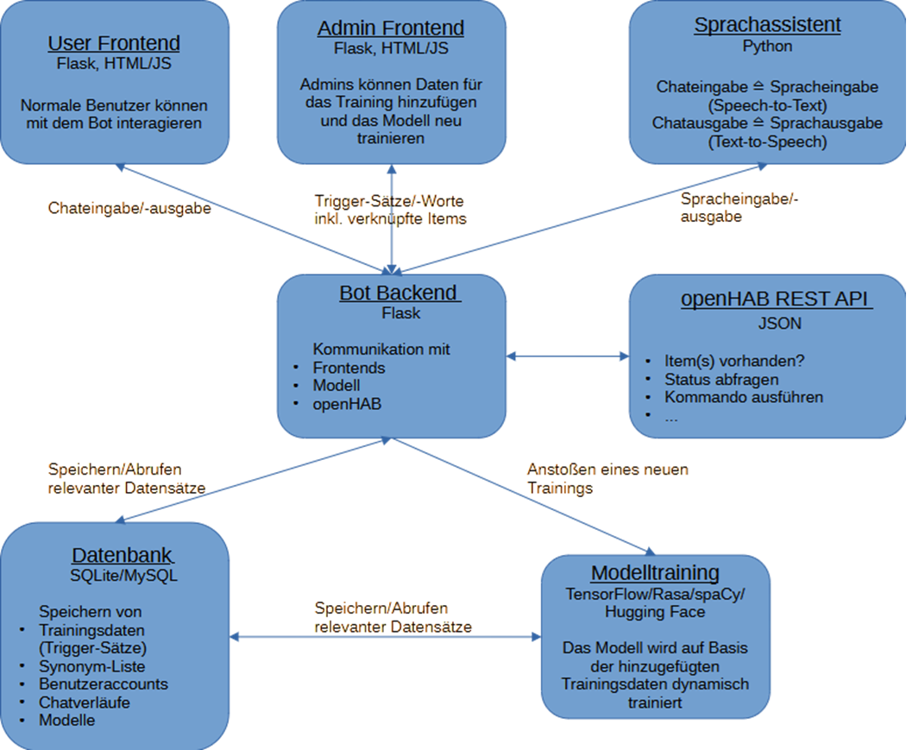

# Konzeption und Implementierung eines webbasierten Chatbots mit trainierbarem KI-Modul zur Interaktion mit openHAB

| | |
| --- | --- |
| **Art** | Bachelorarbeit |
| **Schwerpunkte** | Webentwicklung (Flask), NLP/NLU, Datenbanken, REST |
| **Ausschreibung** | [Chatbot für openHAB.odt](Ausschreibungen/Chatbot%20f%C3%BCr%20openHAB.odt) |
| **Verwandte Ideen** | [Sprachassistent](Sprachassistent.md) (gleiche zentrale API, Sprache statt Text), [State Prediction](State%20Prediction%20mit%20openHAB.md) |

<!-- TOC -->
## Inhaltsverzeichnis

- [🎓 Titelvorschläge für die Bachelorthesis](#-titelvorschläge-für-die-bachelorthesis)
- [📣 Ausschreibungstext für die Bachelorthesis](#-ausschreibungstext-für-die-bachelorthesis)
  - [Beschreibung:](#beschreibung)
  - [Ziele der Arbeit:](#ziele-der-arbeit)
  - [Technologien & Tools:](#technologien--tools)
  - [Voraussetzungen:](#voraussetzungen)
  - [Ergebnis der Arbeit:](#ergebnis-der-arbeit)
- [✅ Vorteile der Trennung von Benutzer-Chat, Admin-Panel und zentraler API](#-vorteile-der-trennung-von-benutzer-chat-admin-panel-und-zentraler-api)
  - [1. Modularität](#1-modularität)
  - [2. Zentrale Kommunikationsschnittstelle (API-Gateway)](#2-zentrale-kommunikationsschnittstelle-api-gateway)
  - [3. Sprachassistent einfach integrierbar](#3-sprachassistent-einfach-integrierbar)
- [🧱 Empfehlung: Systemaufbau (logisch)](#-empfehlung-systemaufbau-logisch)
  - [Idee](#idee)
  - [Was ist das Ziel?](#was-ist-das-ziel)
  - [Möglichkeiten der KI-Entwicklung für diesen Anwendungsfall](#möglichkeiten-der-ki-entwicklung-für-diesen-anwendungsfall)
  - [Projektplanung und Struktur](#projektplanung-und-struktur)
  - [Ansatz: KI-gestützter Chatbot mit TensorFlow (oder Alternativen)](#ansatz-ki-gestützter-chatbot-mit-tensorflow-oder-alternativen)
  - [Exkurs: Wie funktioniert das ohne KI?](#exkurs-wie-funktioniert-das-ohne-ki)
- [🧠 Zusammenfassung:](#-zusammenfassung)
- [✅ Beispiel-Dialoge](#-beispiel-dialoge)
- [Hintergrundwissen](#hintergrundwissen)
- [Aktualitätshinweise (Stand 2026)](#aktualitätshinweise-stand-2026)
<!-- /TOC -->

---

## 🎓 **Titelvorschläge für die Bachelorthesis**

1. **Entwicklung eines KI-gestützten Chatbots für Smart-Home-Steuerung mit Flask und selbsttrainierbarem Modell**
2. **Konzeption und Implementierung eines webbasierten Chatbots mit trainierbarem KI-Modul zur Interaktion mit openHAB**
3. **Webbasierte Benutzer- und Adminoberfläche für ein dynamisch lernfähiges Chatbot-System im Smart-Home-Kontext**
4. **Design und Umsetzung eines selbstlernenden Chatbots mit dynamischem Training über eine Admin-Weboberfläche**
5. **Architektur eines benutzerzentrierten KI-Systems zur Chat-basierten Steuerung von Smart Homes**
6. **Aufbau eines anpassbaren, KI-basierten Dialogsystems mit Flask und dynamischem Modelltraining für Smart Homes**
7. **Entwicklung eines KI-gestützten Chatbots mit dynamischem Training und Web-Oberfläche zur Smart-Home-Interaktion**
8. ...

Der Titel der Thesis muss erst kurz vor Abgabe endgültig feststehen.

---

## 📣 **Ausschreibungstext für die Bachelorthesis**

### **Beschreibung:**

Im Rahmen dieser Bachelorarbeit soll ein interaktives Chatbot-System für die Steuerung von Smart-Home-Geräten über **openHAB** entwickelt werden. Die Besonderheit: Das System soll nicht auf statisch definierten Regeln oder externen KI-Diensten (wie ChatGPT) basieren, sondern eine **eigenständig trainierbare KI** verwenden, die über eine **Weboberfläche von Administratoren gepflegt und erweitert werden kann**.

---

### **Ziele der Arbeit:**

* Entwurf und Umsetzung einer **Flask-basierten Webanwendung** mit zwei Benutzerrollen: Nutzer (Chat) und Administrator (Training).
* Integration einer **KI-Komponente**, die auf Basis von Benutzereingaben trainiert werden kann.
* Implementierung einer **Datenbank** zur Speicherung von Trainingsdaten, Chatverläufen und Benutzerinformationen.
* Aufbau einer **Admin-Oberfläche**, über die Intents, Entitäten und Beispiele eingegeben werden können.
* Dynamische Auslösung des Trainingsprozesses per Button in der Weboberfläche.
* Anbindung an openHAB über die REST API zur Ausführung realer Aktionen im Smart-Home-System.

---

### **Technologien & Tools:**

* **Programmiersprache**: Python
* **Frameworks**: Flask (Web), optional TensorFlow/Rasa/spaCy/Hugging Face (für die KI)
* **Datenbank**: SQLite oder MySQL
* **KI-Training**: Dynamisch über das Admin-Interface
* **API-Kommunikation**: openHAB REST API

---

### **Voraussetzungen:**

* Gute Kenntnisse in Python
* Erste Erfahrungen mit Webentwicklung (Flask, HTML/JS)
* Interesse an künstlicher Intelligenz und maschinellem Lernen
* Selbstständiges Arbeiten und kreative Problemlösung

---

### **Ergebnis der Arbeit:**

Ein **vollständig funktionierender Prototyp** eines KI-gestützten, webbasierten Chatbot-Systems zur Steuerung eines Smart Homes. Die Arbeit kann später erweitert und als Open-Source-Projekt veröffentlicht werden.

---

## ✅ Vorteile der Trennung von Benutzer-Chat, Admin-Panel und zentraler API

### 1. **Modularität**

* **Frontend 1: Benutzer-Chat**

  * Eigene, schmale Oberfläche nur für Endnutzer.
* **Frontend 2: Admin-Panel**

  * Separat, geschützt, mit anderen Funktionen (z. B. Datenpflege, Training).

→ Beide greifen auf dieselbe **zentralisierte API** zu.

---

### 2. **Zentrale Kommunikationsschnittstelle (API-Gateway)**

Ein zentrales Backend (Flask API) dient als Schnittstelle für alle Clients:

```
Clients:
- Benutzer-Chat (Web)
- Admin-Panel (Web)
- Sprachassistent (z. B. Alexa, Raspberry Pi, Android-App)
- Mobile App
→ alle über eine einheitliche REST-API
```

Diese API regelt:

* Authentifizierung (JWT, OAuth, etc.)
* Datenverwaltung (Trainingsdaten, Logs)
* Chat-Dispatch: Anfrage → Modell → Antwort
* Trigger für Modelltraining
* Geräte-Interaktion (über openHAB)

---

### 3. **Sprachassistent einfach integrierbar**

Dies wäre in einem weiteren Projekt (weitere Thesis umsetzbar).

Es gilt:

* Chat-Eingabe → ersetzt durch **Speech-to-Text**
* Chat-Ausgabe → ersetzt durch **Text-to-Speech**

Dazu braucht der Client (z. B. in Python oder als App):

* Mikrofon → STT (z. B. Google Speech, Whisper)
* Text senden → REST-API
* Antwort empfangen → TTS (z. B. pyttsx3, gTTS, ElevenLabs) → Lautsprecher

---

## 🧱 Empfehlung: Systemaufbau (logisch)



### Idee

Aufbau eines **KI-gestützten Chatbots mit einer Web-Oberfläche** zur Verwaltung und **Training** in einem System wie **Flask**. Der Workflow würde sicherstellen, dass **Admins** das Modell trainieren können, ohne tief in den Code einzugreifen, sondern alles über eine Benutzeroberfläche (Admin-Dashboard) steuern. Auch das dynamische **Trainieren des Modells** basierend auf neuen Benutzereingaben ist eine spannende Herausforderung.

Warum dieses Vorgehen?

Ein Smart-Home-System wie openHAB wird immer wieder erweitert. Es kommen neue Geräte und somit Things hinzu, zudem es entsprechend immer wieder neuere Items gibt. Eventuell werden alte Geräte ausgetauscht und gar entfernt, was dazu führt, dass man die dazugehörigen Things und Items ebenfalls löscht. Für den Chatbot bedeutet dies, dass er natürlich immer nur auf den aktuellen Stand des Smart-Homes reagieren soll. Ein Chatbot, welches Informationen von alten Geräten ausgeben möchte, würde zum einen nichts bringen und zum anderen vermutlich gar keien Informationen zurückliefern können. Ebenfalls wäre der Versuch Geräte zu steuern, die gar nicht vorhanden sind fatal. Ein neues Gerät, welches man steuern möchte, könnte dann ebenfalls nicht über den Chatbot gesteuert werden.

Neben dem technisch-funktionalen Vorgehen stellt man im Laufe der Verwendung vielleicht auch fest, dass man Optimierungen haben möchte. Man kann das Modell ja nicht nur neu trainieren, weil Geräte hinzugefügt oder gelöscht wurden, sondern man möchte vielleicht andere Eingaben nutzen, mögliche Synonyme usw., weil man ja viele Sätze nie gleich formuliert. Mit unterschiedlichen Sätzen möchte man aber am Ende unter Umstände das gleiche Ergebnis erzielen. Wenn man dies entsprechend konfigurieren und trainieren kann, hilft dies, die Anwendung benutzerfreundlicher und individueller für den/die Anwender zu gestalten.

---

### **Was ist das Ziel?**

* **Verstehen von Benutzeranfragen**: Die KI soll in der Lage sein, einfache Anfragen zu verstehen (z. B. „Wie ist die Temperatur im Wohnzimmer?“ oder „Schalte das Licht ein“).
* **Interaktion mit openHAB**: Die KI muss diese Anfragen verarbeiten und dann die entsprechenden Aktionen in openHAB auslösen (z. B. den Status von Items abfragen oder Befehle an openHAB senden).

---

### **Möglichkeiten der KI-Entwicklung für diesen Anwendungsfall**

1. **TensorFlow (und Keras)**:
   TensorFlow ist ein sehr mächtiges Framework für maschinelles Lernen und könnte verwendet werden, um **ein Modell für Textklassifikation** oder **Intent-Erkennung** zu trainieren. Du könntest ein Modell erstellen, das Eingaben (z. B. Benutzernachrichten) in bestimmte Kategorien einordnet und dann den entsprechenden Befehl für openHAB ausgibt.

   **Vorteile**:

   * Flexibilität und Leistung für komplexe Modelle.
   * Große Community und viele Ressourcen.

   **Nachteile**:

   * TensorFlow kann relativ komplex sein und erfordert eine gewisse Einarbeitung, besonders bei Textdaten.

2. **Alternativen zu TensorFlow:**
   Hier sind einige andere Frameworks, die sich gut für Textklassifikation und Intent-Erkennung eignen:

   * **spaCy**: Ein schnelles und einfach zu verwendendes NLP-Framework. Es bietet viele vortrainierte Modelle und kann für Named Entity Recognition (NER), Textklassifikation und Intent-Erkennung verwendet werden.
   * **Rasa**: Eine End-to-End-NLP- und Dialog-Management-Lösung, die speziell für Chatbots entwickelt wurde. Mit Rasa kannst du ein Modell trainieren, das sowohl **Intents** (z. B. „Temperatur abfragen“) als auch **Entitäten** (z. B. „Wohnzimmer“) erkennt und auf diese reagiert.
   * **Hugging Face Transformers**: Dies ist eine der modernsten NLP-Bibliotheken mit zahlreichen vortrainierten Modellen wie BERT, T5 oder GPT-2 bzw. offenen Nachfolgemodellen. Damit kannst du ein Modell trainieren, das sowohl das Verstehen als auch das Generieren von Text übernimmt.

---

### **Projektplanung und Struktur**

#### 1. **Systemüberblick**

* **Frontend (Flask + HTML/JS)**:

  * Web-Oberfläche mit einem Login-System.
  * **Benutzer-Chat**: Normale Benutzer können mit dem Bot interagieren.
  * **Admin-Panel**: Admins können Daten für das Training hinzufügen und das Modell neu trainieren.
  * **Datenbank (z. B. SQLite/MySQL)**: Speichern der Trainingsdaten, Chatverläufe, Synonym-Liste, Benutzeraccounts und Modelle.

* **Backend (Flask + Python)**:

  * Flask-Anwendung für die Kommunikation mit dem Frontend und die Verarbeitung der Anfragen.
  * **Modelltraining**: Das Backend wird in der Lage sein, das Modell basierend auf den eingegebenen Daten zu trainieren.
  * **Modell-API**: Ein API-Endpunkt, der auf Chat-Anfragen reagiert, basierend auf einem trainierten Modell.

* **Modell-Training (TensorFlow / Rasa / spaCy / Hugging Face)**:

  * Das Modell wird auf Basis der hinzugefügten Trainingsdaten **dynamisch** trainiert.

#### 2. **Benötigte Daten für das Modell-Training**

Um das Modell zu trainieren, benötigen wir **beispielhafte Fragen (Intents)** und **Entitäten**, die das Modell später klassifizieren soll. Diese Daten können durch **manuelles Hinzufügen** im Admin-Bereich oder durch **automatisches Lernen** aus den Benutzer-Chat-Eingaben generiert werden.

##### Beispiel für Trainingsdaten (strukturierte Form)

Die **Trainingsdaten** bestehen aus zwei Hauptkomponenten:

* **Intents**: Was der Benutzer zu erreichen versucht (z. B. „Temperatur abfragen“).
* **Entitäten**: Bestimmte Informationen aus der Nachricht (z. B. „Wohnzimmer“ als Raumname).

###### Beispiel:

```json
{
    "intents": [
        {
            "intent": "Temperatur_abfragen",
            "examples": [
                "Wie ist die Temperatur im Wohnzimmer?",
                "Was ist die Temperatur im Schlafzimmer?",
                "Wie warm ist es im Wohnzimmer?"
            ],
            "entities": [
                {"entity": "Raum", "value": "Wohnzimmer"},
                {"entity": "Raum", "value": "Schlafzimmer"}
            ]
        },
        {
            "intent": "Licht_steuern",
            "examples": [
                "Schalte das Licht im Flur ein.",
                "Mach das Licht im Wohnzimmer an.",
                "Licht aus im Flur."
            ],
            "entities": [
                {"entity": "Gerät", "value": "Flur_Licht"},
                {"entity": "Gerät", "value": "Wohnzimmer_Licht"}
            ]
        }
    ]
}
```

##### Erklärungen:

* **Intent**: Die allgemeine Bedeutung der Anfrage (z. B. „Temperatur\_abfragen“ oder „Licht\_steuern“).
* **Examples**: Beispiele für Nachrichten, die dem Intent zugeordnet werden.
* **Entities**: Bestimmte Entitäten (z. B. „Wohnzimmer“, „Flur\_Licht“) aus den Beispielen.

Ebenfalls wird deutlich, warum man so etwas wie Synonyme benötigt. Es kann z.B. heißen `Licht ein` oder `Licht an`.

---

#### 3. **Struktur der Anwendung**

* **Flask** verwaltet die Routen für die Benutzeroberfläche, den Chat und das Admin-Panel.
* **Datenbank** (z. B. SQLite oder MySQL): Speichert Benutzeranfragen und Trainingsdaten.

##### **Datenbanktabellen**

* **users**: Speichert Benutzer- und Admin-Daten (für Login).

  ```sql
  CREATE TABLE users (
      id INT PRIMARY KEY AUTO_INCREMENT,
      username VARCHAR(100),
      password VARCHAR(255),  -- Gespeichert als Hash
      role ENUM('user', 'admin')
  );
  ```

* **chat\_history**: Speichert Chatnachrichten zwischen Benutzern und dem Bot.

  ```sql
  CREATE TABLE chat_history (
      id INT PRIMARY KEY AUTO_INCREMENT,
      user_id INT,
      message TEXT,
      response TEXT,
      timestamp DATETIME,
      FOREIGN KEY (user_id) REFERENCES users(id)
  );
  ```

Den Chatverlauf kann man auch für das Training wiederverwenden: Nicht oder unsicher erkannte Eingaben werden von einem Admin geprüft und dem richtigen Intent zugeordnet (*Active Learning*, siehe unten). Das ist überwachtes Lernen mit neuen Daten – Reinforcement Learning im engeren Sinn wäre es erst, wenn das System aus Belohnungen für seine Aktionen lernt.

* **training\_data**: Speichert Trainingsdaten für das Modell.

  ```sql
  CREATE TABLE training_data (
      id INT PRIMARY KEY AUTO_INCREMENT,
      intent VARCHAR(100),
      example TEXT,
      entity VARCHAR(100),
      value VARCHAR(100)
  );
  ```

> Hinweis: Die SQL-Beispiele mischen MySQL-Syntax (`AUTO_INCREMENT`, `ENUM`) und PostgreSQL-Syntax (`SERIAL`). In der Arbeit ein Datenbanksystem festlegen. Ein vollständiges, getestetes SQLite-Beispiel für Synonyme als n:m-Beziehung steht unter [Relationale Modellierung](https://github.com/Michdo93/Informatik/blob/main/Datenbanken/Relationale%20Modellierung.md).

Für **Synonyme** muss man nun ein bisschen komplizierter vorgehen. Hier reicht eine einzige Tabelle nicht aus. Man hat eine `n:m`-Beziehung, bedeutet man muss drei Tabellen anlegen.

Um eine Tabelle für Synonyme in SQL zu erstellen, solltest du eine Datenstruktur wählen, die flexible Beziehungen zwischen Wörtern erlaubt – insbesondere eine **n\:m-Beziehung** (also viele zu vielen). Denn ein Wort kann mehrere Synonyme haben, und ein Synonym kann wiederum für mehrere Wörter gelten.

Lösung: Drei Tabellen

Du kannst drei Tabellen verwenden:

1. **`woerter`** – Liste aller Wörter.
2. **`synonyme`** – Liste aller Synonym-Gruppen oder Paarungen.
3. **`wort_synonym`** – Verknüpfungstabelle, die die n\:m-Beziehung abbildet.

Beispielstruktur:

```sql
-- Tabelle für Wörter
CREATE TABLE woerter (
    id SERIAL PRIMARY KEY,
    wort TEXT NOT NULL UNIQUE
);

-- Tabelle für Synonymgruppen
CREATE TABLE synonymgruppen (
    id SERIAL PRIMARY KEY
);

-- Verknüpfungstabelle zwischen Wörter und Synonymgruppen
CREATE TABLE wort_synonym (
    wort_id INT REFERENCES woerter(id),
    synonymgruppe_id INT REFERENCES synonymgruppen(id),
    PRIMARY KEY (wort_id, synonymgruppe_id)
);
```

Beispiel für die Nutzung:

Wenn du z. B. eine Synonymgruppe für „Auto“, „Wagen“ und „Fahrzeug“ erstellen willst:

```sql
-- Wörter einfügen
INSERT INTO woerter (wort) VALUES ('Auto'), ('Wagen'), ('Fahrzeug');

-- Neue Synonymgruppe erstellen
INSERT INTO synonymgruppen DEFAULT VALUES;

-- IDs abfragen
SELECT id FROM synonymgruppen ORDER BY id DESC LIMIT 1; -- z. B. id = 1
SELECT id FROM woerter WHERE wort IN ('Auto', 'Wagen', 'Fahrzeug'); -- z. B. 1,2,3

-- Verknüpfungen herstellen
INSERT INTO wort_synonym (wort_id, synonymgruppe_id) VALUES
(1, 1), (2, 1), (3, 1);
```

Abfragebeispiel: Synonyme für „Auto“ finden

```sql
SELECT w2.wort
FROM woerter w1
JOIN wort_synonym ws1 ON w1.id = ws1.wort_id
JOIN wort_synonym ws2 ON ws1.synonymgruppe_id = ws2.synonymgruppe_id
JOIN woerter w2 ON ws2.wort_id = w2.id
WHERE w1.wort = 'Auto' AND w2.wort != 'Auto';
```

Alternative: Direkte Paarweise Speicherung (nur bei einfacher Beziehung)

Falls du nur einfache paarweise Synonyme speichern willst (weniger flexibel):

```sql
CREATE TABLE synonyme (
    wort1 TEXT NOT NULL,
    wort2 TEXT NOT NULL,
    PRIMARY KEY (wort1, wort2)
);
```

Das ist allerdings bei größeren Synonymgruppen schwer wartbar und schlecht erweiterbar.

Eventuell ergibt es sogar Sinn, dass man Synonyme nicht in einzelne Worte denkt, sondern vielleicht in ganzen Sätze oder Teilsätze.

Wie genau eine Tabelle für **Modelle** aussieht, hängt letzen Endes sehr stark von dem entwickelten Modell ab. Dies ist dann auch unter Umständen abhängig davon, ob man z. B. spaCy verwendet oder Tensorflow, usw. Vorteile der Speicherung der Modelle hat es, dass man nicht nur zwangsläufig das zuletzt trainierte Modell verwenden kann. Man könnte z. B. im Benutzerchat eine Funktion anbieten, mit der man zwischen den Modellen wechselt (ähnlich, wie z. B. bei ChatGPT). Auch können ältere Modellversionen möglicherweise auch für ein Reinforcement Learning verwendet werden. Im Zweifelsfall kann auch eine Datenbanktabelle für Modelle einfach auch nur als Backup dienen.

Nach einem Training soll das Modell am besten automatisch in eine Datenbank gespeichert werden. Es empfiehlt sich, dass ein Zeitstempel des letzten Trainings gespeichert wird und das es vielleicht ein Feld mit Versionsnummer gibt, welches automatisch iteriert (Das neueste Modell hat immer eine höhere Zahl, als das vorherige. Hier empfiehlt es sich `Integer` als Datentyp zu verwenden).

---

#### 4. **Funktionsweise des Admin-Panels**

* **Admin-Panel**:

  * **Daten hinzufügen**: Admins können neue **Intents** und **Beispiel-Fragen** hinzufügen (über ein Webformular).
  * **Synonyme hinzufügen**: Admins können neue **Synonyme** hinzufügen (über ein Webformular).  
  * **Modell-Training starten**: Ein Button zum Starten des Trainingsprozesses. Nach Klick wird der Backend-Prozess angestoßen, der die Trainingsdaten nimmt und das Modell trainiert. (Ein neues Modell soll nachdem Training automatisch in die Datenbank gespeichert werden)

  ##### **Beispiel für ein Admin-Formular**:

  * **Intent**: Auswahl eines vorhandenen Intents oder Eingabe eines neuen Intents.

  * **Beispiel-Fragen**: Textfeld, in das Admins neue Fragen eingeben können, die dem Intent zugeordnet werden.

  * **Entitäten**: Eingabefelder für die Entitäten (z. B. Raumnamen oder Geräte).

  * **Button „Trainieren“**: Wenn der Admin auf diesen Button klickt, wird der Trainingsprozess angestoßen.

Ein Beispiel für das Speichern der Synonym-Liste lasse ich hier ausnahmsweise weg. Ergibt sich aus den Datenbanktabellen.

---

#### 5. **Automatisiertes Lernen aus Chatnachrichten**

Um das Modell **dynamisch** zu trainieren, können auch **Benutzereingaben** als Trainingsdaten verwendet werden. Dies könnte so ablaufen:

* **Interaktionen speichern**: Jede Nachricht, die der Benutzer sendet, wird zusammen mit der Antwort des Bots in der **Datenbank** gespeichert.
* **Trainingsdaten generieren**: Ein Admin kann dann alle gespeicherten Benutzernachrichten durchsuchen und entscheiden, ob diese in das Training aufgenommen werden sollen.
* **Verfeinerung**: Nach einer gewissen Anzahl von Interaktionen kann das Modell mit diesen neuen Beispielen neu trainiert werden, um auf häufig gestellte Fragen und neue Anfragen besser zu reagieren.

---

#### 6. **Trainingsprozess**

* **Button „Trainieren“**: Wenn der Admin den Button klickt, wird das System:

  * Die aktuellen Trainingsdaten aus der Datenbank abrufen.
  * Das Modell (z. B. TensorFlow oder spaCy) mit den neuen Daten trainieren.
  * Die neuen Modellparameter speichern und das aktualisierte Modell im Backend bereitstellen.

Auch hier muss man sich möglicherweise überlegen, ob man die Modellparameter oder das ganze Modell speichert. Vermutlich ergibt sogar beides Sinn. Die Modellparameter können ja über andere Tabellen bereits gespeichert sein und würden für ein erneutes Training ja bereits ausreichen.

---

#### 7. **Projektaufbau (Workflow)**

* **Login**: Benutzer und Admins melden sich an.
* **Benutzer-Chat**: Normale Benutzer können mit dem Bot interagieren, ihre Nachrichten werden gespeichert.
* **Admin-Paneel**: Admins können Daten für das Training hinzufügen und das Modell trainieren.
* **Training starten**: Admin klickt auf „Trainieren“, um das Modell mit neuen Daten zu trainieren.
* **Modell verwenden**: Sobald das Modell trainiert ist, wird es für die Chatbot-Interaktionen verwendet.

---

#### 8. **Dynamisches Lernen im Chat**

Um das Modell kontinuierlich zu verbessern, könnten Benutzereingaben nach einer **Bestätigung** durch den Admin ins Training aufgenommen werden. Dies wäre eine Form des „**aktiven Lernens**“ (engl. **active learning**).

#### **Zusammenfassung**:

Das System könnte folgendermaßen aufgebaut werden:

1. **Frontend** (Flask + HTML/JS) für den Chat und Admin-Bereich.
2. **Backend** (Flask + Python) zur Verarbeitung von Nachrichten und Verwaltung des Trainingsprozesses.
3. **Datenbank** zur Speicherung von Benutzerinformationen, Chats und Trainingsdaten.
4. **Modelltraining** über einen Admin-Button, der das Modell mit den neuesten Trainingsdaten aktualisiert.

**Wichtige Schritte für den Aufbau**:

1. Design und Implementierung der **Datenbankstruktur**.
2. Aufbau der **Flask-Anwendung** für den Chat und das Admin-Panel.
3. Erstellung der **Trainingslogik** und Integration des **KI-Modells**.
4. Erstellung der **Admin-Oberfläche** zur Verwaltung von Trainingsdaten und Training des Modells.

Ich denke dies ist bislang nur ein Vorschlag zum Systementwurf. Der ist relativ präzise. Während der Bearbeitung entstehen aber möglicherweise andere Anforderungen bzw. man wird feststellen, dass man manche Dinge vielleicht etwas anders strukturieren und entwickeln muss. Dieses Vorgehen soll jedoch erläutern, wie man sich das geplante System in etwa vorstellen können soll.

---

### **Ansatz: KI-gestützter Chatbot mit TensorFlow (oder Alternativen)**

#### 1. **Daten sammeln**:

Um ein Modell zu trainieren, musst du zunächst eine Datenbasis aufbauen, die aus **Beispiel-Fragen** und den dazugehörigen **Befehlen** besteht. Diese Daten könnten aussehen wie:

```plaintext
Frage: "Wie ist die Temperatur im Wohnzimmer?"
Befehl: "GET:Wohnzimmer_Temperatur"

Frage: "Schalte das Licht im Flur ein."
Befehl: "SET:Flur_Licht:ON"
```

Datenbeispiel für das Training (Absicht + Entität):

```plaintext
"Wie ist die Temperatur im Wohnzimmer?" -> Intent: "Temperatur_abfragen", Entity: "Wohnzimmer"
"Schalte das Flurlicht ein." -> Intent: "Licht_steuern", Entity: "Flur_Licht", Action: "ON"
```

#### 2. **Modell mit TensorFlow trainieren**:

##### a. **Daten vorbereiten**:

Du kannst den Text in **numerische Features** umwandeln, z. B. mit einem **Tokenizer** oder einer **Word Embedding**-Methode (wie Word2Vec oder GloVe), um ein Modell zu trainieren.

##### b. **Modellarchitektur**:

Für Textklassifikation eignet sich eine **Neural Network Architektur**, die auf **Recurrent Neural Networks (RNNs)** oder **Long Short-Term Memory (LSTM)** basiert. Eine andere Möglichkeit ist die Verwendung von **Convolutional Neural Networks (CNNs)**, die ebenfalls bei Textklassifikationen gut funktionieren.

Hier ist ein grundlegendes Beispiel, wie ein **Textklassifikator** in TensorFlow mit **Keras** aussehen könnte:

##### Beispielcode mit TensorFlow (LSTM):

```python
import tensorflow as tf
from tensorflow.keras import layers, models
from tensorflow.keras.preprocessing.text import Tokenizer
from tensorflow.keras.preprocessing.sequence import pad_sequences
import numpy as np

# Beispiel-Daten: Frage-Antwort-Paare
questions = [
    "Wie ist die Temperatur im Wohnzimmer?",
    "Schalte das Licht im Flur ein.",
    "Wie ist die Temperatur im Schlafzimmer?",
    "Schalte das Wohnzimmerlicht aus."
]

labels = [
    "GET:Wohnzimmer_Temperatur",
    "SET:Flur_Licht:ON",
    "GET:Schlafzimmer_Temperatur",
    "SET:Wohnzimmer_Licht:OFF"
]

# Tokenizer initialisieren
tokenizer = Tokenizer()
tokenizer.fit_on_texts(questions)
sequences = tokenizer.texts_to_sequences(questions)
X = pad_sequences(sequences, padding='post')

# Labels in numerische Form umwandeln
label_to_id = {label: idx for idx, label in enumerate(set(labels))}
y = np.array([label_to_id[label] for label in labels])

# Modell erstellen (LSTM)
model = models.Sequential([
    layers.Embedding(input_dim=len(tokenizer.word_index) + 1, output_dim=50, input_length=X.shape[1]),
    layers.LSTM(64),
    layers.Dense(32, activation='relu'),
    layers.Dense(len(label_to_id), activation='softmax')
])

# Modell kompilieren und trainieren
model.compile(loss='sparse_categorical_crossentropy', optimizer='adam', metrics=['accuracy'])
model.fit(X, y, epochs=10, batch_size=2)

# Vorhersage treffen
def predict_intent(message):
    sequence = tokenizer.texts_to_sequences([message])
    padded = pad_sequences(sequence, padding='post', maxlen=X.shape[1])
    pred = model.predict(padded)
    predicted_label = np.argmax(pred)
    return list(label_to_id.keys())[predicted_label]

# Beispiel-Nachricht
message = "Schalte das Licht im Flur ein."
predicted_command = predict_intent(message)
print("Vorhergesagter Befehl:", predicted_command)
```

Bitte beachte, dass dies nur ein Beispiel ist, welches nicht in eine Gesamtstruktur eingebunden ist. In aktuellen Keras-Versionen (Keras 3) ist `keras.preprocessing.text.Tokenizer` veraltet; stattdessen die Schicht `TextVectorization` verwenden. Für wenige Trainingsbeispiele ist ein LSTM außerdem überdimensioniert – ein einfacher Klassifikator (z. B. TF-IDF + logistische Regression) ist eine gute **Baseline**, siehe [Intents, Entities & Confidence](https://github.com/Michdo93/Informatik/blob/main/KI%20%26%20Sprachverarbeitung/Intents%2C%20Entities%20%26%20Confidence.md).

#### 3. **Daten für Training erweitern**:

Die Qualität des Modells hängt von der Menge und Vielfalt der Trainingsdaten ab. Du kannst die Daten erweitern, indem du mehr Fragen und Antworten hinzufügst. Hier sind einige Beispiele:

```plaintext
Frage: "Wie ist die Temperatur im Wohnzimmer?"
Frage: "Wie hoch ist die Temperatur im Wohnzimmer?"
Frage: "Wie warm ist es im Wohnzimmer?"

Frage: "Schalte das Licht im Flur aus."
Frage: "Mach das Licht im Flur aus."
Frage: "Flurlicht aus"
```

Du kannst auch **Datenaugmentation** verwenden, um deine Trainingsdaten zu erweitern und das Modell robuster zu machen.

---

#### **Alternativen zu TensorFlow**

Wie bereits erwähnt, gibt es auch **andere Tools** wie **Rasa** oder **spaCy**, die sich speziell auf die Entwicklung von Chatbots konzentrieren und dir viele vorgefertigte Modelle und Funktionen bieten, um die Absicht und Entitäten zu erkennen.

* **Rasa**:

  * Open-Source-NLP-Framework für Chatbots.
  * Bietet eine einfache Möglichkeit, **Intents** und **Entitäten** zu definieren und zu trainieren.
  * Unterstützt **Sprachdialoge** und kann auch mit openHAB kombiniert werden.
* **spaCy**:

  * Schnelles und modernes NLP-Toolkit.
  * Sehr gut für Named Entity Recognition (NER) geeignet und könnte helfen, die verschiedenen Geräte und Werte in deinen Fragen zu erkennen.
* **Hugging Face**:

  * Diese Bibliothek ist besonders leistungsfähig, wenn du ein **Transformers-Modell** wie BERT oder GPT-2 einsetzen möchtest, um kontextuelle Bedeutung zu verstehen.

---

##### **Zusammenfassung**:

* **TensorFlow** ist eine starke Wahl für das Trainieren eines **Custom NLP-Modells** zur Intent-Erkennung, benötigt aber viele Trainingsdaten und Anpassung.
* **spaCy** oder **Rasa** bieten dir einfachere Alternativen für einen Chatbot, die spezifische Tools für **Intent-Erkennung und Dialog-Management** bieten.
* **Hugging Face** könnte eine sehr mächtige Option sein, wenn du tiefer in vortrainierte Modelle wie BERT oder GPT einsteigen möchtest.

Wenn du ein **leichtgewichtiges, spezialisiertes Modell** benötigst, würde ich dir zu **Rasa** oder **spaCy** raten. Durch Recherche kann man ggf. auch weitere KI-Technologien in Betracht ziehen. Dies gilt hier lediglich nur als Vorschlag.

---

### Exkurs: Wie funktioniert das ohne KI?

Es ist nicht empfohlen auf eine **KI** zu verzichten. Man kann (besser gesagt könnte) aber den Chatbot so gestalten, dass er auf bestimmte, vordefinierte Fragen oder Befehle reagiert, basierend auf einer **regelbasierten Logik**. Das bedeutet, der Bot erkennt bestimmte Muster in der Benutzereingabe und löst daraufhin entsprechende Aktionen in openHAB aus.

Das wäre ein einfacherer Ansatz, der keine externe KI benötigt. Dies bedeutet aber, dass ein Benutzer keine individuellen Abweichungen sich erlauben kann. Es würde exakt ein einziger vordefinierter Satz geben und sollte dieser erkannt werden, wird entsprechend darauf reagiert. Man kann auch listenbasiert vorgehen, wie z. B., dass in einem Satz vier oder fünf Wörter vorkommen muss. Dann wäre egal, welcher Satz genau eingegeben wurde, sobald diese vier oder fünf Wörter vorkommen, wird dann die entsprechende Regel damit getriggert. Wenn man nur eine Liste mit ein oder zwei Wörtern hat, kann man die Sätze nicht gut genug voneinander unterscheiden. Hat man wiederum eine Liste mit zu vielen Wörtern, dann ist es ebenfalls denkbar, dass der Benutzer es nicht schafft, einen geeigneten Satz zu formulieren.

Genau dieser Umstand führt dazu, dass man mit einer **regelbasierten Logik** nur bis zu einem gewissen Punkt gut arbeiten kann. Je komplexer die Anforderungen des Benutzers sind, desto mehr wird eine **KI** notwendig.

---

#### 🛠 Beispiel für einen **regelbasierten Chatbot** in Python mit Flask

In diesem Beispiel reagiert der Bot auf vordefinierte Fragen wie:

* „Wie ist die Temperatur im Wohnzimmer?“
* „Schalte das Licht im Flur ein.“

Der Bot nutzt **Python** und **Flask** als Backend, um über die openHAB REST API mit deinem Smart Home zu kommunizieren.

Die Sätze müssten in diesem Beispiel relativ exakt so formuliert werden, sonst würde keine Antwort erfolgen.

##### 🔧 1. Backend in Flask

```python
from flask import Flask, render_template, request, jsonify
import requests

# === Konfiguration ===
OPENHAB_BASE_URL = 'http://openhab.local:8080/rest'  # openHAB-URL anpassen
TEMPERATURE_ITEM = 'Wohnzimmer_Temperatur'  # openHAB Item für Temperatur

app = Flask(__name__)

# === openHAB: Status abfragen ===
def get_item_state(item_name):
    try:
        response = requests.get(f"{OPENHAB_BASE_URL}/items/{item_name}/state")
        response.raise_for_status()
        return response.text
    except Exception as e:
        return f"Fehler: {e}"

# === openHAB: Item setzen ===
def set_item_state(item_name, command):
    try:
        response = requests.post(f"{OPENHAB_BASE_URL}/items/{item_name}", data=command,
                                 headers={'Content-Type': 'text/plain'})
        response.raise_for_status()
        return "OK"
    except Exception as e:
        return f"Fehler: {e}"

# === Regelbasierte Logik für den Chatbot ===
def process_message(user_message):
    user_message = user_message.lower()

    if "temperatur" in user_message and "wohnzimmer" in user_message:
        state = get_item_state(TEMPERATURE_ITEM)
        return f"Die aktuelle Temperatur im Wohnzimmer beträgt: {state}°C."

    elif "licht" in user_message and "flur" in user_message and "ein" in user_message:
        result = set_item_state('Flur_Licht', 'ON')
        return f"Das Licht im Flur wurde eingeschaltet. Ergebnis: {result}"

    elif "licht" in user_message and "flur" in user_message and "aus" in user_message:
        result = set_item_state('Flur_Licht', 'OFF')
        return f"Das Licht im Flur wurde ausgeschaltet. Ergebnis: {result}"

    else:
        return "Entschuldigung, das habe ich nicht verstanden. Versuche es mit einer anderen Anfrage."

# === Routen ===
@app.route("/")
def index():
    return render_template("chat.html")

@app.route("/chat", methods=["POST"])
def chat():
    user_message = request.json.get("message", "")
    reply = process_message(user_message)
    return jsonify({"reply": reply})

if __name__ == "__main__":
    app.run(debug=True)    # development only - in production use Gunicorn behind Nginx
```

Man kann den nachfolgenden Teil kürzen:

```python
elif "licht" in user_message and "flur" in user_message and "aus" in user_message:
```

Dieser könnte auch wie folgt dann aussehen:

```python
elif all(word in user_message for word in ["licht", "flur", "aus"]):
```

(Der Ausdruck `["licht", "flur", "aus"] in user_message` funktioniert in Python **nicht** – eine Liste kann nicht in einem String gesucht werden. `all(...)` prüft, ob **jedes** Wort vorkommt. Achtung: `"aus" in user_message` ist auch bei „H**aus**“ wahr – besser den Satz vorher in Wörter zerlegen.)

Idealerweise würde man hier natürlich auch die Worte aus einer Datenbank auslesen und Regeln über Datenbanken erstellen lassen. Auch eine Möglichkeit für Synonyme wäre, dass man z. B. `flur` und `Flur` erlaubt. Ebenfalls möglich ist es, dass man alle Worte einheitlich zu klein ändert, damit man die Groß-/Kleinschreibung als Fehlerquelle elementiert. Dies kann ja auch mal versehentlich durch Tippfehler bei der Chateingabe entstehen.

In diesem Beispiel ist jetzt die Verarbeitung der Chateingabe statisch. Durch eine Verwendung einer Datenbank, könnte man diesen Teil dann bereits dynamisch gestalten. Spätestens wenn an dieser Stelle eine **KI** angedockt wird, wird man um eine dynamische Verarbeitung nicht drumherum kommen.

In dem gekürzten Teil sieht man, dass auch eine Liste verwendet werden kann. Schaue ich mir den ersten Teilcode an, dann sehe ich eine **UND**-Verknüpfung. Auch so könnte man sich vorstellen, dass anstelle eines Wortes jedesmal eine Synonym-Liste verwendet wird. Man könnte ja ein Wort abfragen und eine Liste mit allen Synonymen zurückgeben. Wenn man Listen verwendet, dann kann ich auch eine Liste mit einer anderen Liste ergänzen, was ebenfalls eine Möglichkeit wäre, um Synonyme für eine Überprüfung einzupflegen.

#### 🔧 2. Frontend in HTML (chat.html)

```html
<!DOCTYPE html>
<html>
<head>
  <title>openHAB Chatbot</title>
  <script>
    async function sendMessage() {
      const input = document.getElementById("message");
      const chat = document.getElementById("chat");

      const userText = input.value;
      chat.innerHTML += "<b>Du:</b> " + userText + "<br>";

      const response = await fetch("/chat", {
        method: "POST",
        headers: { "Content-Type": "application/json" },
        body: JSON.stringify({ message: userText })
      });

      const data = await response.json();
      chat.innerHTML += "<b>Bot:</b> " + data.reply + "<br><br>";
      input.value = "";
    }
  </script>
</head>
<body>
  <h1>💬 openHAB Chatbot</h1>
  <div id="chat" style="border:1px solid #ccc; padding:10px; height:300px; overflow:auto;"></div>
  <input type="text" id="message" placeholder="Nachricht..." onkeydown="if(event.key==='Enter')sendMessage()" />
  <button onclick="sendMessage()">Senden</button>
</body>
</html>
```

Ich empfehle grundlegend, wenn man ein Frontend verwendet, dass man am besten etwas vorgefertigtes nutzt. Es gilt mittlerweile als Standard, dass man das Frontend-Framework [Bootstrap](https://getbootstrap.com/) nutzt. Dann hat man nicht nur schon ein schönes und vorgefertigtes Desing, sondern kann auch bereits auf einige nützliche JavaScript-Funktionen zurückgreifen. Dies gibt dem Gestalter auch für Interaktionen bessere Möglichkeiten.

---

#### 🔍 Was passiert hier?

1. **Flask Backend**:

   * Wenn ein Benutzer eine Nachricht sendet, wird diese vom Server verarbeitet.
   * Der Bot sucht nach bestimmten Schlüsselwörtern (z. B. „Temperatur“, „Licht“, „Flur“).
   * Je nach Nachricht ruft der Bot entweder den **Status eines Items** ab oder sendet einen **Befehl an openHAB**, um ein Gerät zu steuern.

2. **Frontend (HTML)**:

   * Du hast eine einfache Benutzeroberfläche, in der du Nachrichten eingeben kannst.
   * Die Antwort des Bots wird unter der Chatbox angezeigt.

---

#### 💡 Erweiterungsmöglichkeiten

* **Weitere Geräte und Items**: Du kannst den Bot um weitere openHAB-Geräte (z. B. Heizungen, Jalousien) erweitern, indem du zusätzliche Bedingungen in der `process_message`-Funktion hinzufügst.
* **Sprachsteuerung**: Du könntest auch Spracherkennung (z. B. mit der Google Speech-to-Text API) hinzufügen, um die Nachrichten per Sprache zu senden.
* **Nutzerfreundlichkeit**: Erweiterungen wie die Möglichkeit, mehrere Geräte zu steuern oder zu kombinieren (z. B. „Schalte das Wohnzimmerlicht und die Heizung an“).

Weitere Geräte und Items lassen sich sehr viel schöner natürlich durch eine Datenbank hinzufügen. Hier dann entsprechend gleich mit ihrer Regel. Die Nutzerfreundlichkeit ist meiner Meinung nach hier nicht ideal. Mit einer Datenbank wird dies schöner, weil man nicht den Programmcode ändern muss, sondern der Benutzer kann das Programm durch eine Weboberfläche erweitern.

---

#### Fazit

In diesem Szenario brauchst du keine KI, sondern baust einen **regelbasierten Chatbot**, der auf spezifische Eingaben reagiert. Der Vorteil ist, dass du die volle Kontrolle über die Funktionalitäten hast, ohne auf komplexe KI-Systeme angewiesen zu sein. Nachteile sind, dass dies nicht dynamisch ist (eine Datenbank würde abhilfe schaffen) und man nur eingeschränkte Chateingaben zulassen könnte.

---

## 🧠 Zusammenfassung:

* ✅ Trennung von Benutzer-UI und Admin-UI (ggf. kann man ja noch andere Dienste, wie einen Sprachassistenten anbinden).
* ✅ Zentrale API mit klaren Funktionen
* ✅ Zukunftssicher durch Sprachintegration und weitere Clients
* ✅ Bessere Sicherheit, Wartbarkeit und Erweiterbarkeit

---

## ✅ Beispiel-Dialoge

Fragen nach einem Systemzustand:

> **Du:** Wie warm ist es im Wohnzimmer?

> **Bot:** Der aktuelle Zustand von Wohnzimmer\_Temperatur ist: 22.5 °C

Senden von einem Befehl:

> **Du:** Schalte das Flurlicht ein.

> **Bot:** Befehl 'ON' an Flur\_Licht gesendet. Ergebnis: OK

Anmerkung: Die Items können natürlich sehr viele eigene Namen haben.

> **Du:** Schalte das Licht im Smart-Home-Labor ein.

> **Bot:** Befehl 'ON' an iSmartHome_Hue_Lampen_Schalter gesendet. Ergebnis: OK

Auch könnte man Things anstelle von Items abfragen.

> **Du**: Welche Geräte gibt es in der Küche?

> **Bot**: In der Küche gibt es einen Backofen, einen Kaffeevollautomaten, einen Herd, eine Dunstabzugshaube, einen Geschirrspüler, einen Wasserkocher, einen Kühlschrank und einen Lautsprecher. Möchtest du, dass ich eines dieser Geräte für dich bediene oder möchtest du einen bestimmten Zustand von einem Gerät abfragen?

Fragen:

* Wie bekommt man für die Ausgabe hin, dass man nach Abfrage der REST API z. B. `der/die/das` oder `ein, eine, einen`, usw. richtig im Satz integriert?
* Wie bekommt man es hin, dass z. B. nicht der Name des Things verwendet wird? Dieser könnte z.B. lauten `tKueche_Sonos_Lautsprecher`.

Lösungsmöglichkeiten:

* Fuzzy Matching
* Datenbanktabellen vergleichbar zu Synonyme
* ...

> **Du**: Welche Funktionen hat der Kaffeevollautomat?

> **Bot**: Ein/Ausschalten, Reinigen, Kaffee brühen, usw. Möchtest du, dass ich dir einen Kaffee brühe?

Auch hier vielleicht ein Mapping anhand von einer Datenbanktabelle. Es würde Sinn ergeben, wenn sowohl Things als auch Items gemappt werden, sodass der Text schöner lesbar ist. Alternativ müsste man sonst alle Items auflisten.

Ich denke an diesen Beispieldialogen wird deutlich, dass der Administrator das System durchaus individuell konfigurieren muss.

Macht ein Whitelisting bzw. Blacklisting Sinn? Über eine sogenannte `Whitelist` werden z. B. Things oder Items erlaubt und über eine `Blacklist` verboten. Da der Administrator das System konfigurieren können soll, würde man wahrscheinlich eine `Whitelist` erstellen, heißt bei der Nachfrage, welche Geräte sich z. B. in der Küche befinden, wäre es denkbar, dass nur die in einer Datenbanktabelle gespeicherten Geräte erkannt werden und nicht alle Geräte, die openHAB ansonst kennen würde. Dasselbe Vorgehen würde sich auch bei Funktionen bzw. Items einsetzen lassen.

> **Du**: Dimme das Licht in der Küche auf 20%.
> **Bot**: Befehl '20' an iSmartHome_Hue_Lampen_Dimmer gesendet. Ergebnis: OK

Bei manchen Befehlen ergibt es zusätzlich Sinn, wenn der Benutzer einen Parameter mitgeben kann.

Wenn wir Synonyme, Mappings und Co. alles mal weglassen, dann kann ein erfahrener Benutzer, der sich mit dem Smart-Home-System auskennt sicherlich auch Eingaben tätigen, wie:

> **Du**: Sende '20' an 'iSmartHome_Hue_Lampen_Dimmer'.

oder

> **Du**: Setze 'iSmartHome_Hue_Lampen_Schalter' auf 'ON'.

oder:

> **Du**: Sende 'ON' an 'iSmartHome_Hue_Lampen_Schalter'.


---

## Hintergrundwissen

Die Grundlagen zu den Begriffen dieser Idee sind im Kompendium **Informatik** ausführlich erklärt:

| Thema | Kurz | Ausführlich |
| --- | --- | --- |
| **Fuzzy Matching** | Unscharfe Suche über Editierdistanzen (Levenshtein, Damerau-Levenshtein, Hamming, Jaro-Winkler); korrigiert Tippfehler, aber keine Umformulierungen. In Python: **RapidFuzz** (Nachfolger von fuzzywuzzy) | [Fuzzy Matching](https://github.com/Michdo93/Informatik/blob/main/KI%20%26%20Sprachverarbeitung/Fuzzy%20Matching.md) |
| **Intent, Entity, Confidence** | Intent = Absicht (Klasse), Entity = Parameter (Raum, Gerät, Wert), Confidence = Sicherheit der Zuordnung mit Schwellwert für Ausführen, Rückfrage oder Fallback | [Intents, Entities & Confidence](https://github.com/Michdo93/Informatik/blob/main/KI%20%26%20Sprachverarbeitung/Intents%2C%20Entities%20%26%20Confidence.md) |
| **Synonyme in der Datenbank** | n:m-Beziehung über eine Zwischentabelle | [Relationale Modellierung](https://github.com/Michdo93/Informatik/blob/main/Datenbanken/Relationale%20Modellierung.md) |
| **Training, Test, Metriken** | Daten aufteilen, Overfitting, Precision/Recall, Modellversionierung | [Machine-Learning-Grundlagen](https://github.com/Michdo93/Informatik/blob/main/KI%20%26%20Sprachverarbeitung/Machine-Learning-Grundlagen.md) |
| **Whitelist** | Nur freigegebene Items dürfen gesteuert werden | [Whitelist & Blacklist](https://github.com/Michdo93/Informatik/blob/main/Zugriffskontrolle/Whitelist%20%26%20Blacklist.md) |
| **REST API** | Commands (POST) vs. States (GET/PUT), Authentifizierung | [HTTP & REST](https://github.com/Michdo93/Informatik/blob/main/Netzwerk/HTTP%20%26%20REST.md) |
| **Betrieb der Flask-App** | Gunicorn hinter Nginx statt `flask run` | [Web-Server & Deployment](https://github.com/Michdo93/Informatik/blob/main/Best%20Practices/Web-Server%20%26%20Deployment.md) |

---

## Aktualitätshinweise (Stand 2026)

* **LLM-basierte Ansätze** sind seit der ersten Fassung dieser Idee deutlich leistungsfähiger und auch lokal (z. B. über Ollama) betreibbar geworden. Die Ausschreibung grenzt externe KI-Dienste bewusst aus; ein lokales LLM als **Vergleichsansatz** oder als **Fallback** für nicht erkannte Eingaben kann trotzdem eine sinnvolle Erweiterung sein.
* openHAB bringt mit dem **Human Language Interpreter** (z. B. Standard-Interpreter, HABot) bereits eigene Mechanismen zur Textinterpretation mit. Die Arbeit sollte diese kennen und sich davon abgrenzen.
* Bei **Rasa** Ausrichtung und Lizenzbedingungen der aktuellen Version prüfen.
