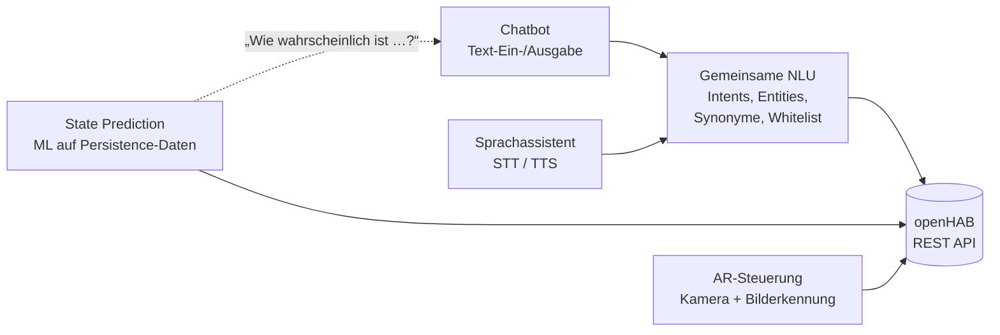

# 💡 SmartHome-Ideen

Ideen für Smart-Home-Projekte rund um **openHAB** – ausgearbeitet als Vorschläge für **Abschlussarbeiten** (Bachelor, ggf. Master) und größere Studienprojekte im **Smart Home Labor der Hochschule Furtwangen (HFU)**.

Jede Idee beschreibt Ziel, Anforderungen, mögliche Architektur und Technologien. Die Vorschläge sind bewusst **Ausgangspunkte**, keine festen Pflichtenhefte: Während der Bearbeitung dürfen und sollen Technologien begründet ausgetauscht und Anforderungen präzisiert werden.

<!-- TOC -->
## Inhaltsverzeichnis

- [Übersicht](#übersicht)
- [Wie die Ideen zusammenhängen](#wie-die-ideen-zusammenhängen)
- [Grundlagen](#grundlagen)
- [Weitere Themen aus dem Labor-Backlog](#weitere-themen-aus-dem-labor-backlog)
- [Eine neue Idee aufnehmen](#eine-neue-idee-aufnehmen)
<!-- /TOC -->

## Übersicht

| Idee | Art | Schwerpunkte | Ausschreibung |
| --- | --- | --- | --- |
| [Augmented Reality-basierte Steuerung über openHAB auf Android](Android-AR-Steuerung%20mit%20openHAB.md) | Bachelorarbeit | Android, AR (ARCore, Unity/Vuforia), Bilderkennung, REST | [ODT](Ausschreibungen/Android-AR-Steuerung%20mit%20openHAB.odt) |
| [Webbasierter Chatbot mit trainierbarem KI-Modul für openHAB](Chatbot%20f%C3%BCr%20openHAB.md) | Bachelorarbeit | Flask, NLU (Intents/Entities), Datenbanken, Admin-Oberfläche | [ODT](Ausschreibungen/Chatbot%20f%C3%BCr%20openHAB.odt) |
| [Lokaler, datenschutzfreundlicher Sprachassistent](Sprachassistent.md) | Bachelorarbeit, Erweiterung zur Masterarbeit denkbar | Wakeword, Speech-to-Text, NLU, Text-to-Speech, Embedded, Datenschutz | – |
| [Vorhersage von Gerätezuständen (State Prediction)](State%20Prediction%20mit%20openHAB.md) | Bachelorarbeit | Machine Learning, Zeitreihen, openHAB Persistence, Dashboard | [ODT](Ausschreibungen/State%20Prediction%20mit%20openHAB.odt) |

> Die Ausschreibungstexte im Ordner [Ausschreibungen](Ausschreibungen/) sind die **Kurzfassungen** zum Aushängen. Die Markdown-Dateien enthalten die ausführliche Ausarbeitung und werden laufend aktualisiert. Bei Abweichungen gilt die mit der Betreuung abgestimmte Fassung.

---

## Wie die Ideen zusammenhängen

Mehrere Ideen teilen sich Bausteine – sie lassen sich auch nacheinander oder als aufeinander aufbauende Arbeiten bearbeiten:

* **Chatbot und Sprachassistent** unterscheiden sich vor allem in der Ein- und Ausgabe (Text vs. Sprache). Eine gemeinsame, zentrale API für das Sprachverstehen kann von beiden genutzt werden.
* **State Prediction** liefert Wahrscheinlichkeiten, die ein Chatbot oder Sprachassistent abfragen oder für Vorschläge nutzen könnte.
* Alle Ideen nutzen die **openHAB REST API** – für Python z. B. über den `python-openhab-rest-client`.

---

## Grundlagen

Das nötige Hintergrundwissen ist im Kompendium **[Informatik](https://github.com/Michdo93/Informatik)** ausführlich beschrieben:

| Thema | Dokument |
| --- | --- |
| Machine Learning: Training/Test, Overfitting, Datenlecks, Metriken, Baseline, Transfer Learning | [Machine-Learning-Grundlagen](https://github.com/Michdo93/Informatik/blob/main/KI%20%26%20Sprachverarbeitung/Machine-Learning-Grundlagen.md) |
| Intents, Entities, Confidence, regelbasiert vs. ML vs. LLM | [Intents, Entities & Confidence](https://github.com/Michdo93/Informatik/blob/main/KI%20%26%20Sprachverarbeitung/Intents%2C%20Entities%20%26%20Confidence.md) |
| Fuzzy Matching (Levenshtein, Damerau-Levenshtein, RapidFuzz) | [Fuzzy Matching](https://github.com/Michdo93/Informatik/blob/main/KI%20%26%20Sprachverarbeitung/Fuzzy%20Matching.md) |
| Sprachassistenten: Wakeword, STT, TTS, SSML, Wartungsstatus lokaler Werkzeuge | [Sprachassistenten](https://github.com/Michdo93/Informatik/blob/main/KI%20%26%20Sprachverarbeitung/Sprachassistenten.md) |
| Datenbankentwurf, n:m-Beziehungen, Bilder als Pfad vs. BLOB | [Relationale Modellierung](https://github.com/Michdo93/Informatik/blob/main/Datenbanken/Relationale%20Modellierung.md) |
| Zeitreihen, InfluxDB, openHAB Persistence | [Zeitreihen & openHAB Persistence](https://github.com/Michdo93/Informatik/blob/main/Datenbanken/Zeitreihen%20%26%20openHAB%20Persistence.md) |
| openHAB REST API, HTTP-Methoden, Authentifizierung | [HTTP & REST](https://github.com/Michdo93/Informatik/blob/main/Netzwerk/HTTP%20%26%20REST.md) |
| Flask-Anwendungen richtig betreiben (Gunicorn, Nginx) | [Web-Server & Deployment](https://github.com/Michdo93/Informatik/blob/main/Best%20Practices/Web-Server%20%26%20Deployment.md) |
| Projektdokumentation | [Best Practice Dokumentation](https://github.com/Michdo93/Informatik/blob/main/Best%20Practices/Dokumentation.md) |

---

## Weitere Themen aus dem Labor-Backlog

Im **[Smart-Home-Labor-Backlog](https://github.com/Michdo93/Smart-Home-Labor-Backlog)** stehen Vorhaben, die sich ebenfalls für Studienprojekte oder Abschlussarbeiten eignen und hier später als eigene Idee ausgearbeitet werden können, z. B.:

* **ESP32-CSI-Präsenzsensor** – Anwesenheitserkennung über WLAN Channel State Information
* **People Counter** – Personenzählung mit Tiefenkamera, Verbesserung der Zählgenauigkeit
* **Gestensteuerung für den Newspaper Projector** – Gestenerkennung mit Kinect
* **Reverse Engineering von Geräten ohne offene Schnittstelle** (z. B. Beam Labs Beam, Hologram Fan Projector)
* **Berührungslose Interaktion mit Kinect-Kameras** – unsichtbare Wandschalter, interaktive Projektion
* **NAO Gym Instructor** – Portierung einer früheren Abschlussarbeit auf Raspberry Pi und Kinect
* **ROS 2 und openHAB** – Roboter und Smart Home tauschen Zustände und Befehle aus
* **Smart Home Security Lab** – Sicherheitsthemen praktisch untersuchen
* **Smart-Home-Krimi in AR** – interaktives Krimi-/Escape-Erlebnis mit HoloLens, Robotern und openHAB

Eine Übersicht über alle vorhandenen Repositories (integriert, ungetestet, deprecated) bietet die [Repository-Übersicht](https://github.com/Michdo93/Smart-Home-Labor-Backlog/blob/main/Repositories.md).

---

## Eine neue Idee aufnehmen

1. [IDEE-VORLAGE.md](IDEE-VORLAGE.md) kopieren und mit einem sprechenden Namen speichern.
2. Kurzbeschreibung, Ziele und Anforderungen ausfüllen – Architektur und Technologien dürfen zunächst grob bleiben.
3. In die Übersichtstabelle oben eintragen.
4. Optional: Kurzfassung als Ausschreibung unter `Ausschreibungen/` ablegen.

> **Hinweis zu Technologien:** Werkzeuge im KI-Umfeld werden schnell umbenannt, aufgekauft oder eingestellt. Jede Idee enthält deshalb Aktualitätshinweise; vor Beginn einer Arbeit sollte der Stand der genannten Bibliotheken geprüft werden.

---
